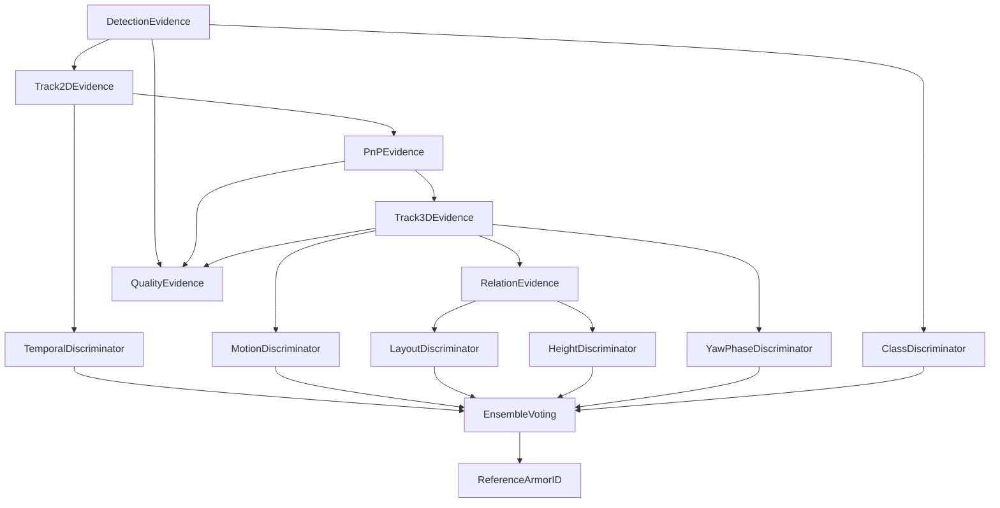

# 基于证据层 DAG 的装甲板 2D/3D 跟踪与 armor_id 判别设计

## 1. 设计背景与目标

在 Robomaster 自瞄系统中，视觉前端通常会从图像中检测出若干块装甲板，并输出装甲板的外接框、关键角点、类别置信度等信息。后续系统需要完成两个不同层面的任务：

1. **时间连续性维护**：判断当前帧的某个 2D 检测目标是否与上一帧的某个目标属于同一块可见装甲板。
2. **机器人内部 armor_id 判别**：判断该可见装甲板在目标机器人结构中对应哪一个真实装甲板编号，例如前、后、左、右，或者内部定义的 0/1/2/3 号装甲板。

这两个任务的语义不同，不宜混在同一个 tracker 里处理。

本文提出一种分层设计：

```text
Detection
  ↓
Evidence DAG 层
  ├── 2D Tracker Evidence
  ├── PnP / Pose Evidence
  ├── 3D Tracker Evidence
  ├── Relation Evidence
  └── Quality Evidence
  ↓
Armor ID Discriminator 层
  ├── Height Discriminator
  ├── Yaw Phase Discriminator
  ├── Relative Layout Discriminator
  ├── Temporal Consistency Discriminator
  └── Class / Number Discriminator
  ↓
Ensemble / Voting 层
  ↓
Reference armor_id + confidence
```

其中：

```text
tracker_id：图像域/证据层内部的临时轨迹编号
armor_id：机器人结构中的真实装甲板编号
```

二者不能直接等价。

---

## 2. 核心设计动机

### 2.1 为什么优先做 2D 关联

在相机可以稳定输出 **90 FPS 全局曝光图像** 的前提下，帧间运动较小，运动畸变较少，图像域目标连续性较好。因此，在 PnP 之前先做 2D 数据关联是合理的。

2D 关联的误差链较短：

```text
检测框 / 角点误差
→ 2D 匹配代价
→ tracker_id 更新
```

而如果直接在 PnP 之后基于 3D 位置误差和 yaw 误差做主关联，会引入更长的误差链：

```text
2D 角点误差
→ PnP 非线性解算误差
→ 相机内参/畸变误差
→ 装甲板尺寸建模误差
→ TF 时间同步误差
→ odom 系 3D 位置误差
→ 装甲板 yaw 误差
→ 3D 数据关联结果
```

因此，2D tracker 更适合解决：

```text
当前帧检测目标是否延续上一帧的同一块可见装甲板？
```

而 3D tracker 更适合解决：

```text
这个 tracker_id 对应的空间状态是否稳定、是否符合运动模型、是否能为 armor_id 判别提供证据？
```

### 2.2 为什么要引入 Evidence DAG

传统实现容易把以下逻辑耦合在一起：

```text
2D 关联
PnP 解算
3D 状态估计
目标 ID 绑定
开火决策
```

这会带来几个问题：

1. **错误容易反向污染**：例如 armor_id 判错后，如果直接反向修改 tracker 状态，可能导致错误被持续强化。
2. **调试困难**：无法判断错误来自检测、PnP、3D track、关系判断还是 ID 判别。
3. **扩展困难**：新增一种证据，例如高度差、yaw 相位、重投影误差、装甲板间距时，需要改动很多模块。
4. **降级困难**：当某类证据不可用时，不容易让系统自然退化为较弱但稳定的模式。

因此，将 2D tracker、3D tracker 和关系信息统一抽象为 **证据生产节点**，并用有向无环图保证单向依赖，是更清晰的工程结构。

---

## 3. 总体架构

### 3.1 分层结构

```text
┌──────────────────────────────────────────────┐
│ Detection Layer                              │
│ YOLO-Pose / 传统视觉 / 装甲板检测             │
└───────────────────────┬──────────────────────┘
                        ↓
┌──────────────────────────────────────────────┐
│ Evidence DAG Layer                           │
│ 只负责生产、更新、缓存、发布证据               │
│ 不直接决定真实 armor_id                       │
└───────────────────────┬──────────────────────┘
                        ↓
┌──────────────────────────────────────────────┐
│ Discriminator Layer                          │
│ 订阅证据节点，独立输出 armor_id 假设           │
└───────────────────────┬──────────────────────┘
                        ↓
┌──────────────────────────────────────────────┐
│ Ensemble / Voting Layer                      │
│ 对多个判别器结果加权融合，输出参考 armor_id    │
└──────────────────────────────────────────────┘
```

### 3.2 DAG 单向依赖示意



DAG 设计要求：

```text
1. 上游证据可以被下游证据读取。
2. 下游判别结果不能反向修改上游 tracker_id。
3. Discriminator 只输出假设，不直接改变 Evidence DAG。
4. Ensemble 输出的是参考 armor_id，而不是强制真值。
```

---

## 4. Evidence DAG 层设计

Evidence DAG 层的职责是：

```text
从检测结果、2D 轨迹、PnP、3D 轨迹和多目标关系中提取可解释证据。
```

它不直接负责：

```text
判定真实 armor_id
控制云台
决定是否开火
```

### 4.1 证据节点分类

| 节点 | 输入 | 输出 | 作用 |
|---|---|---|---|
| DetectionEvidenceNode | 检测器输出 | bbox、角点、类别、置信度 | 原始视觉观测 |
| Track2DEvidenceNode | DetectionEvidence | tracker_id、2D 速度、生命周期 | 维护图像域连续性 |
| PnPEvidenceNode | Track2D + keypoints | pose_cam、重投影误差 | 将 2D 观测转为 3D 位姿观测 |
| Track3DEvidenceNode | PnP + TF | position、velocity、armor_yaw、yaw_rate、z 统计 | 维护空间状态 |
| RelationEvidenceNode | 多个 Track3D | 高度差、距离差、相对 yaw 差 | 形成结构关系证据 |
| QualityEvidenceNode | Detection/PnP/Track3D | 质量评分、异常分数 | 评估证据可靠性 |

### 4.2 证据对象设计

建议将每个 tracker_id 的证据组织成一个统一对象：

```cpp
struct ArmorEvidence {
  int tracker_id = -1;

  rclcpp::Time stamp;

  // ---------- 2D evidence ----------
  cv::Rect2f bbox;
  cv::RotatedRect rotated_rect;
  std::array<cv::Point2f, 4> keypoints;
  cv::Point2f image_center;
  cv::Point2f image_velocity;
  float bbox_area = 0.0f;
  float detection_confidence = 0.0f;
  int class_id = -1;
  float class_confidence = 0.0f;

  // ---------- 2D track state ----------
  int age = 0;
  int hit_count = 0;
  int miss_count = 0;
  bool is_confirmed = false;

  // ---------- PnP evidence ----------
  bool has_pnp = false;
  Eigen::Isometry3d pose_camera;
  double reprojection_error = 0.0;
  double pnp_condition_score = 0.0;

  // ---------- 3D evidence ----------
  bool has_3d = false;
  Eigen::Vector3d position_odom;
  Eigen::Vector3d velocity_odom;
  Eigen::Vector3d acceleration_odom;

  // 这里的 yaw 是装甲板朝向 yaw，不是机器人本体航向角
  double armor_yaw = 0.0;
  double armor_yaw_rate = 0.0;
  double armor_yaw_acc = 0.0;

  // ---------- prior/statistical evidence ----------
  double z_mean = 0.0;
  double z_var = 0.0;
  double pitch_residual = 0.0;
  double roll_residual = 0.0;

  // ---------- relation evidence ----------
  std::vector<double> height_diff_to_others;
  std::vector<double> distance_to_others;
  std::vector<double> yaw_diff_to_others;

  // ---------- quality ----------
  double quality_score = 1.0;
  double outlier_score = 0.0;
};
```

---

## 5. 2D Tracker Evidence 设计

### 5.1 2D tracker 的语义

2D tracker 负责图像平面上的同一目标绑定：

```text
当前帧 detection
  ↓
匹配上一帧已有 track
  ↓
输出 tracker_id
```

这里的 `tracker_id` 只表示：

```text
Evidence DAG 内部的临时轨迹编号
```

它不表示：

```text
机器人真实装甲板编号
装甲板在机器人坐标系中的固定编号
物理结构语义上的前/后/左/右
```

### 5.2 2D track 状态

可以基于 SORT 思路，对每个 2D 目标维护一个轻量 Kalman Filter。

基础状态：

```text
x_2d = [u, v, du, dv]^T
```

其中：

```text
u, v：图像中心点
du, dv：图像平面速度
```

若需要跟踪尺度：

```text
x_2d = [u, v, w, h, du, dv, dw, dh]^T
```

其中：

```text
w, h：bbox 或最小外接矩形的宽高
dw, dh：尺度变化率
```

若 YOLO-Pose 输出四个角点，建议额外维护角点平滑值：

```text
kp_i = [u_i, v_i], i = 0,1,2,3
```

可选扩展状态：

```text
x_2d_pose = [
  center_u, center_v,
  width, height,
  angle,
  d_center_u, d_center_v,
  d_width, d_height,
  d_angle
]^T
```

适用于基于 `cv::RotatedRect` 或灯条方向的跟踪。

### 5.3 2D 数据关联代价

不建议只使用 IoU。对于装甲板目标，建议组合以下因素：

```text
cost =
  w_center * center_distance_norm
+ w_iou    * (1 - IoU)
+ w_kp     * keypoint_distance_norm
+ w_cls    * class_mismatch_penalty
+ w_scale  * scale_change_penalty
```

其中：

```text
center_distance_norm =
  || center_det - center_pred || / image_diag

keypoint_distance_norm =
  mean_i || kp_det_i - kp_pred_i || / image_diag

scale_change_penalty =
  | log(area_det / area_pred) |

class_mismatch_penalty =
  0, if class_id is same
  1, if class_id is different
```

类别不稳定时，建议将类别作为软惩罚，而不是硬拒绝。

### 5.4 2D gating

在 Hungarian 匹配之前先做门控，过滤明显不合理匹配：

```text
center_distance < center_threshold
IoU > iou_threshold 或 keypoint_distance < kp_threshold
area_ratio ∈ [area_ratio_min, area_ratio_max]
class 不发生严重冲突
```

可初始使用：

```text
center_threshold：30 ~ 80 px
iou_threshold：0.1 ~ 0.3
keypoint_distance_threshold：20 ~ 50 px
area_ratio：[0.5, 2.0]
```

实际阈值应根据图像分辨率、目标速度、检测噪声和相机帧率调参。

### 5.5 2D tracker 生命周期

每个 track 维护：

```text
age：存活帧数
hit_count：成功匹配次数
miss_count：连续丢失次数
is_confirmed：是否成为稳定轨迹
```

推荐策略：

```text
1. detection 未匹配到已有 track → 创建 tentative track
2. tentative track 连续命中 N 帧 → confirmed
3. confirmed track 连续丢失超过 M 帧 → 删除
4. 未 confirmed 的 track 如果很快丢失 → 直接删除
```

示例参数：

```text
min_hits = 2 ~ 3
max_miss = 3 ~ 8
```

在 90 FPS 场景下，`max_miss = 5` 大约对应 55 ms，可根据遮挡情况增大。

### 5.6 2D tracker 输出

```cpp
struct Track2DEvidence {
  int tracker_id;
  rclcpp::Time stamp;

  cv::Rect2f bbox;
  cv::RotatedRect rotated_rect;
  std::array<cv::Point2f, 4> keypoints;

  cv::Point2f center;
  cv::Point2f velocity_2d;

  int class_id;
  float detection_confidence;
  float track_confidence;

  int age;
  int hit_count;
  int miss_count;
  bool is_confirmed;
};
```

---

## 6. PnP Evidence 设计

PnP 节点将 2D keypoints 转换为相机系位姿观测。

### 6.1 输入

```text
Track2DEvidence
相机内参 K
畸变参数 D
装甲板 3D 几何尺寸
图像时间戳
```

### 6.2 输出

```text
pose_camera
translation_camera
rotation_camera
reprojection_error
pnp_quality_score
```

### 6.3 PnP 质量评价

PnP 不应只输出位姿，还应输出可用于后续 gating 的质量信息：

```text
重投影误差
角点分布是否退化
深度是否合理
姿态 pitch/roll 是否符合先验
与上一帧位姿是否突变
```

可定义：

```text
pnp_quality_score =
  f(reprojection_error, depth_validity, pose_prior_residual)
```

例如：

```text
reprojection_error < 2 px：高质量
2 px ~ 5 px：可用但降权
> 5 px：低质量或拒绝
```

---

## 7. 3D Tracker Evidence 设计

### 7.1 3D tracker 的语义

3D tracker 维护每个 `tracker_id` 在 odom 系或目标统一参考系下的空间状态。

它负责：

```text
1. 维护 tracker_id 对应的 3D 位置连续性
2. 估计装甲板朝向 yaw 及其变化率
3. 统计 z 高度均值和方差
4. 为 armor_id 判别器提供稳定空间证据
```

它不负责：

```text
直接判定真实 armor_id
直接修改 2D tracker_id
```

### 7.2 状态定义

可从较简单的状态开始：

```text
x_3d = [
  x, y, z,
  vx, vy, vz,
  yaw,
  yaw_rate
]^T
```

如果需要二阶量：

```text
x_3d = [
  x, y, z,
  vx, vy, vz,
  ax, ay, az,
  yaw,
  yaw_rate,
  yaw_acc
]^T
```

如果希望对装甲板朝向做更平滑的建模，可以只保留 yaw 的二阶或三阶量：

```text
yaw_state = [
  yaw,
  yaw_rate,
  yaw_acc
]^T
```

注意：

```text
这里的 yaw 是装甲板平面法向或装甲板朝向在水平面上的角度，
不是一般意义上的机器人本体航向角。
```

### 7.3 观测输入

PnP + TF 之后得到：

```text
z_3d = [
  x_obs,
  y_obs,
  z_obs,
  yaw_obs
]^T
```

也可以包含：

```text
pitch_obs
roll_obs
reprojection_error
depth
```

其中 pitch/roll 通常用于质量评价和先验约束，而不一定作为主要状态量。

### 7.4 3D gating

3D tracker 内部可以基于预测与观测误差做门控：

```text
position_error = || p_obs - p_pred ||

yaw_error = wrapToPi(yaw_obs - yaw_pred)

z_error = | z_obs - z_mean |
```

基础 gating：

```text
position_error < p_threshold
|yaw_error| < yaw_threshold
z_error < z_threshold
reprojection_error < reproj_threshold
```

若使用协方差，可使用 Mahalanobis gating：

```text
d² = innovationᵀ S⁻¹ innovation
```

其中：

```text
innovation = z_obs - h(x_pred)
S = H P Hᵀ + R
```

接受条件：

```text
d² < chi_square_threshold
```

### 7.5 z 高度统计

装甲板在 odom 系中的高度具有较强先验：

```text
装甲板 pitch ≈ 15°
装甲板 roll ≈ 0°
同一块装甲板的 z 高度应在短时间内相对恒定
```

因此，每个 3D track 可以维护：

```text
z_mean
z_var
z_count
```

在线更新：

```text
z_mean_k = z_mean_{k-1} + α (z_obs - z_mean_{k-1})

z_var_k = (1 - α) z_var_{k-1}
        + α (z_obs - z_mean_k)^2
```

用途：

```text
1. 检测 PnP 或 TF 异常
2. 为高度差判别器提供证据
3. 估计不同装甲板之间的相对高度关系
4. 在短时遮挡后辅助恢复
```

### 7.6 3D tracker 输出

```cpp
struct Track3DEvidence {
  int tracker_id;
  rclcpp::Time stamp;

  Eigen::Vector3d position_odom;
  Eigen::Vector3d velocity_odom;
  Eigen::Vector3d acceleration_odom;

  double armor_yaw;
  double armor_yaw_rate;
  double armor_yaw_acc;

  double z_mean;
  double z_var;

  double position_residual;
  double yaw_residual;
  double reprojection_error;

  double track3d_confidence;
  bool is_3d_valid;
};
```

---

## 8. Relation Evidence 设计

Relation Evidence 用于从多个 3D track 中提取结构关系。

### 8.1 关系证据类型

对于任意两个 tracker：

```text
track_i
track_j
```

可以计算：

```text
height_diff_ij = z_i - z_j

distance_ij = || p_i - p_j ||

yaw_diff_ij = wrapToPi(yaw_i - yaw_j)

relative_position_ij = p_j - p_i
```

还可以构造：

```text
同一机器人假设下的装甲板间距
装甲板高度层级
yaw 相位差
与估计机器人中心的相对方位
```

### 8.2 关系证据的意义

单块装甲板的信息可能不足以判断真实 armor_id，但多块装甲板之间的相对关系通常更稳定。

例如：

```text
1. 前后装甲板的 yaw 相位可能相差约 π
2. 左右装甲板的 yaw 相位可能相差约 π
3. 不同装甲板高度可能存在固定差异
4. 同一机器人上的装甲板间距有物理约束
```

这些关系可以作为后续 Discriminator 的输入。

### 8.3 Relation Evidence 输出

```cpp
struct RelationEvidence {
  rclcpp::Time stamp;

  struct PairRelation {
    int tracker_id_i;
    int tracker_id_j;

    double height_diff;
    double distance;
    double yaw_diff;

    Eigen::Vector3d relative_position;
    double relation_confidence;
  };

  std::vector<PairRelation> pair_relations;
};
```

---

## 9. Quality Evidence 设计

Quality Evidence 用于统一表达证据可靠性。

### 9.1 质量来源

可以综合：

```text
检测置信度
类别置信度
2D tracker 连续命中次数
2D miss_count
PnP 重投影误差
3D innovation 大小
z 高度稳定性
yaw 观测稳定性
TF 时间差
```

### 9.2 质量评分示例

```text
quality_score =
  q_det
* q_track2d
* q_pnp
* q_track3d
* q_time_sync
```

其中每一项范围为 `[0, 1]`。

例如：

```text
q_pnp = exp(-reprojection_error² / σ_reproj²)

q_track2d = clamp(hit_count / min_hits, 0, 1)

q_time_sync = exp(-Δt_tf² / σ_time²)
```

Quality Evidence 的作用：

```text
1. 给 Discriminator 加权
2. 给 Ensemble 加权
3. 标记异常证据
4. 触发降级策略
```

---

## 10. Armor ID Discriminator 层设计

### 10.1 Discriminator 的职责

Discriminator 订阅 Evidence DAG 中的一个或多个证据节点，输出某个 tracker_id 属于各个真实 armor_id 的假设分布。

它不直接输出唯一真值，而是输出：

```text
P(armor_id = 0)
P(armor_id = 1)
P(armor_id = 2)
P(armor_id = 3)
confidence
source
```

### 10.2 统一接口

```cpp
struct ArmorIdHypothesis {
  int tracker_id;
  rclcpp::Time stamp;

  std::vector<double> id_prob;  // size = armor_id_count
  double confidence;

  std::string source_name;
  std::string debug_info;
};

class ArmorIdDiscriminator {
public:
  virtual ~ArmorIdDiscriminator() = default;

  virtual std::string name() const = 0;

  virtual ArmorIdHypothesis infer(
      const EvidenceGraphSnapshot& evidence) = 0;
};
```

### 10.3 典型 Discriminator

#### 10.3.1 HeightDiscriminator

输入：

```text
z_mean
z_var
height_diff_to_others
```

输出依据：

```text
若某些装甲板高度有固定先验，则根据高度匹配程度输出 armor_id 分布。
```

适用场景：

```text
不同装甲板安装高度存在可区分差异
或者机器人结构导致可见装甲板高度有稳定层级
```

#### 10.3.2 YawPhaseDiscriminator

输入：

```text
armor_yaw
yaw_rate
多个 track 之间的 yaw_diff
```

输出依据：

```text
根据装甲板朝向相位与机器人结构模型的匹配程度判断 armor_id。
```

注意：

```text
该 yaw 是装甲板朝向 yaw，不是机器人整体航向角。
```

#### 10.3.3 RelativeLayoutDiscriminator

输入：

```text
多个装甲板的相对位置
装甲板间距
装甲板间 yaw 差
```

输出依据：

```text
将当前观测到的局部装甲板布局与机器人结构模板匹配。
```

适用场景：

```text
同时观测到多块装甲板
或者短时间内通过跟踪积累到多个装甲板空间关系
```

#### 10.3.4 TemporalConsistencyDiscriminator

输入：

```text
tracker_id 历史绑定结果
历史 id_prob
track age
hit_count
miss_count
```

输出依据：

```text
若某 tracker_id 在一段时间内稳定倾向于某 armor_id，则增强该假设。
```

作用：

```text
抑制单帧误判
提高 ID 绑定稳定性
```

#### 10.3.5 ClassDiscriminator

输入：

```text
检测类别
数字识别结果
类别置信度
```

输出依据：

```text
如果检测类别与某个 armor_id 有对应关系，则提供直接证据。
```

注意：

```text
类别识别可能受模糊、遮挡、曝光影响，因此建议作为软证据，而不是唯一依据。
```

#### 10.3.6 MotionConsistencyDiscriminator

输入：

```text
3D 位置预测误差
yaw 预测误差
速度连续性
加速度连续性
```

输出依据：

```text
如果某 armor_id 假设下的运动模型更连续，则提高其概率。
```

---

## 11. Ensemble / Voting 层设计

### 11.1 组合模式

多个 Discriminator 可以被组合成一个 Composite Discriminator。

```cpp
class CompositeArmorIdDiscriminator : public ArmorIdDiscriminator {
public:
  void add(std::shared_ptr<ArmorIdDiscriminator> discriminator,
           double weight);

  ArmorIdHypothesis infer(
      const EvidenceGraphSnapshot& evidence) override;

private:
  std::vector<std::shared_ptr<ArmorIdDiscriminator>> discriminators_;
  std::vector<double> weights_;
};
```

### 11.2 加权投票

每个 Discriminator 输出：

```text
id_prob_i
confidence_i
weight_i
```

融合分数：

```text
score(id) =
  Σ_i weight_i * confidence_i * id_prob_i(id)
```

归一化：

```text
P_final(id) = score(id) / Σ_j score(j)
```

最终输出：

```text
reference_armor_id = argmax_id P_final(id)

final_confidence = max_id P_final(id)
```

### 11.3 稳定绑定策略

不建议单帧输出直接成为强绑定结果。

可以维护时间滤波：

```text
P_smooth_k(id) =
  β * P_smooth_{k-1}(id)
+ (1 - β) * P_final_k(id)
```

当满足以下条件时才认为稳定绑定：

```text
max_id P_smooth(id) > bind_threshold
且连续 K 帧 argmax 不变
且 evidence quality 足够高
```

示例：

```text
bind_threshold = 0.75 ~ 0.9
stable_frames = 3 ~ 8
```

### 11.4 输出结构

```cpp
struct ArmorIdDecision {
  int tracker_id;
  rclcpp::Time stamp;

  int reference_armor_id;
  std::vector<double> final_prob;
  double confidence;

  bool is_stable_binding;
  std::vector<ArmorIdHypothesis> hypotheses;

  std::string debug_info;
};
```

---

## 12. 数据流完整示例

### 12.1 单帧处理流程

```text
1. 检测器输出 detections
2. DetectionEvidenceNode 生成原始检测证据
3. Track2DEvidenceNode 基于 SORT 思想完成 2D 数据关联
4. PnPEvidenceNode 对每个有效 2D track 解算位姿
5. Track3DEvidenceNode 更新每个 tracker_id 的 3D 状态
6. RelationEvidenceNode 统计多 track 之间的高度差、位置差、yaw 差
7. QualityEvidenceNode 评估每条证据的可靠性
8. 多个 Discriminator 订阅证据并输出 armor_id 假设
9. EnsembleVoting 融合多个假设，输出参考 armor_id
```

### 12.2 输出给后端的内容

建议输出两类信息：

#### A. 基础跟踪观测

```cpp
struct TrackedArmorObservation {
  int tracker_id;
  rclcpp::Time stamp;

  cv::Rect2f bbox;
  std::array<cv::Point2f, 4> keypoints;

  Eigen::Vector3d position_odom;
  double armor_yaw;

  double observation_quality;
};
```

#### B. armor_id 参考绑定结果

```cpp
struct ArmorBindingReference {
  int tracker_id;
  int reference_armor_id;

  std::vector<double> armor_id_prob;
  double confidence;
  bool is_stable;
};
```

后端状态估计器可以使用：

```text
tracker_id 维护短期观测连续性
reference_armor_id 作为软标签或参考绑定
confidence 决定是否采用该绑定
```

---

## 13. 降级与异常处理

### 13.1 2D tracker 正常，PnP 异常

表现：

```text
2D 连续性稳定，但 PnP 重投影误差大或深度跳变
```

处理：

```text
1. 保留 2D tracker_id
2. 暂停更新 3D track
3. 降低该 tracker 的 quality_score
4. Discriminator 不使用低质量 3D 证据
```

### 13.2 PnP 正常，3D gating 失败

表现：

```text
PnP 输出合理，但与 3D 预测差异过大
```

处理：

```text
1. 判断是否发生快速机动或遮挡恢复
2. 若连续失败，重置该 tracker_id 的 3D 状态
3. 不反向删除 2D tracker，除非 2D 也失配
```

### 13.3 armor_id 判别不稳定

表现：

```text
多个 Discriminator 输出冲突
最终概率分布不集中
```

处理：

```text
1. 输出 unknown 或低置信度 armor_id
2. 保留 tracker_id
3. 等待更多证据累积
4. 不强行绑定
```

### 13.4 多个 tracker 竞争同一 armor_id

表现：

```text
两个 tracker_id 都高概率对应同一个 armor_id
```

处理：

```text
1. 基于 confidence 做优先级分配
2. 使用二分图匹配约束一对一绑定
3. 低置信度 tracker 输出 unknown
```

可以在 Ensemble 后加入全局一致性约束：

```text
tracker_id ↔ armor_id
```

做一次 Hungarian 或最大权匹配。

---

## 14. 调试与可视化建议

### 14.1 图像层可视化

在 debug image 上显示：

```text
tracker_id
2D velocity arrow
bbox / rotated rect
keypoints
track confidence
miss_count
```

示例显示：

```text
T12 cls=3 conf=0.86 hit=8 miss=0
```

### 14.2 3D 层可视化

在 RViz / Foxglove 中显示：

```text
tracker_id 对应的 3D marker
position_odom
armor_yaw arrow
z_mean / z_var
3D track confidence
```

### 14.3 armor_id 判别可视化

显示每个 tracker 的概率分布：

```text
T12:
  id0: 0.12
  id1: 0.76
  id2: 0.08
  id3: 0.04
  final: id1 stable=true
```

### 14.4 日志建议

每帧或低频输出：

```text
[EvidenceDAG] tracks2d=3 tracks3d=2 valid_pnp=2
[Track2D] id=12 cost=0.24 iou=0.31 kp_err=8.2px
[Track3D] id=12 pos_err=0.08 yaw_err=0.06 z_var=0.002
[Discriminator] id=12 height=[0.1,0.7,0.1,0.1] yaw=[0.2,0.6,0.1,0.1]
[Ensemble] id=12 final=[0.15,0.72,0.08,0.05] ref=1 stable=1
```

---

## 15. 工程实现建议

### 15.1 初始版本优先级

建议按以下顺序实现：

```text
1. DetectionEvidenceNode
2. Track2DEvidenceNode
3. PnPEvidenceNode
4. Track3DEvidenceNode
5. QualityEvidenceNode
6. 简单 Class / Temporal Discriminator
7. WeightedVoteEnsembler
8. RelationEvidenceNode
9. Height / Yaw / Layout Discriminator
```

### 15.2 不建议一开始过度复杂

初始阶段可以先做：

```text
2D tracker：
  center distance + IoU + keypoint distance

3D tracker：
  position + yaw 常速度模型

Discriminator：
  temporal consistency + class soft score

Ensemble：
  weighted voting
```

稳定后再加入：

```text
高度差
装甲板间距
yaw 相位
全局一对一匹配
贝叶斯融合
```

### 15.3 模块边界

推荐边界：

```text
Tracker 不判定真实 armor_id
Discriminator 不修改 tracker 状态
Ensemble 不参与 PnP 或滤波
开火决策不直接依赖单帧 armor_id
```

### 15.4 ROS2 节点划分

可以有两种实现方式。

#### 方案 A：单节点内部模块化

```text
armor_evidence_tracker_node
  ├── detection subscriber
  ├── evidence graph manager
  ├── 2d tracker
  ├── pnp solver
  ├── 3d tracker
  ├── discriminator manager
  └── debug publisher
```

优点：

```text
低延迟
方便共享内存数据
避免过多 topic 序列化
```

缺点：

```text
节点内部复杂度较高
```

#### 方案 B：多节点拆分

```text
armor_2d_tracker_node
armor_pnp_node
armor_3d_tracker_node
armor_id_discriminator_node
```

优点：

```text
职责清晰
方便独立调试
```

缺点：

```text
topic 传输和同步成本更高
高帧率下可能增加延迟
```

对于 90 FPS 自瞄链路，推荐优先使用方案 A，即单节点内部模块化。

---

## 16. 关键原则总结

### 16.1 tracker_id 与 armor_id 分离

```text
tracker_id：由 2D/3D 跟踪产生的临时轨迹编号
armor_id：机器人结构中的真实装甲板编号
```

这两个 ID 不应混用。

### 16.2 2D 与 3D 都是证据生产者

```text
2D tracker 生产图像连续性证据
3D tracker 生产空间连续性证据
Relation node 生产结构关系证据
Quality node 生产可靠性证据
```

### 16.3 armor_id 判别是后置推理任务

```text
Discriminator 只基于证据输出假设
Ensemble 融合多个假设
最终输出参考 armor_id 和置信度
```

### 16.4 禁止判别结果污染上游跟踪

```text
armor_id 结果不能反向强制修改 tracker_id
```

否则可能产生错误闭环：

```text
错误 armor_id
→ 错误修正 tracker
→ tracker 继续支持错误 armor_id
→ 错误被强化
```

### 16.5 输出软结果而不是硬结果

推荐输出：

```text
armor_id probability distribution
confidence
stable flag
```

而不是单个硬编号。

---

## 17. 最终设计概括

该设计可以概括为：

```text
用 2D tracker 维护图像域同一装甲板的时间连续性；
用 PnP 和 3D tracker 维护 tracker_id 对应的空间状态；
用 Evidence DAG 统一管理 2D、3D、关系和质量证据；
用多个 Discriminator 独立推断 armor_id 假设；
用组合模式或加权投票融合多个判别器结果；
最终输出参考 armor_id、概率分布和置信度。
```

一句话总结：

> 2D/3D tracker 不直接绑定真实装甲板编号，而是持续生产可解释证据；真实 armor_id 由后置判别器基于证据进行软推理，并通过集成投票得到更稳定的参考绑定结果。

这种设计具有较好的可解释性、可扩展性和降级能力，适合在高帧率全局曝光相机场景下作为自瞄系统的数据关联与装甲板编号判别框架。
