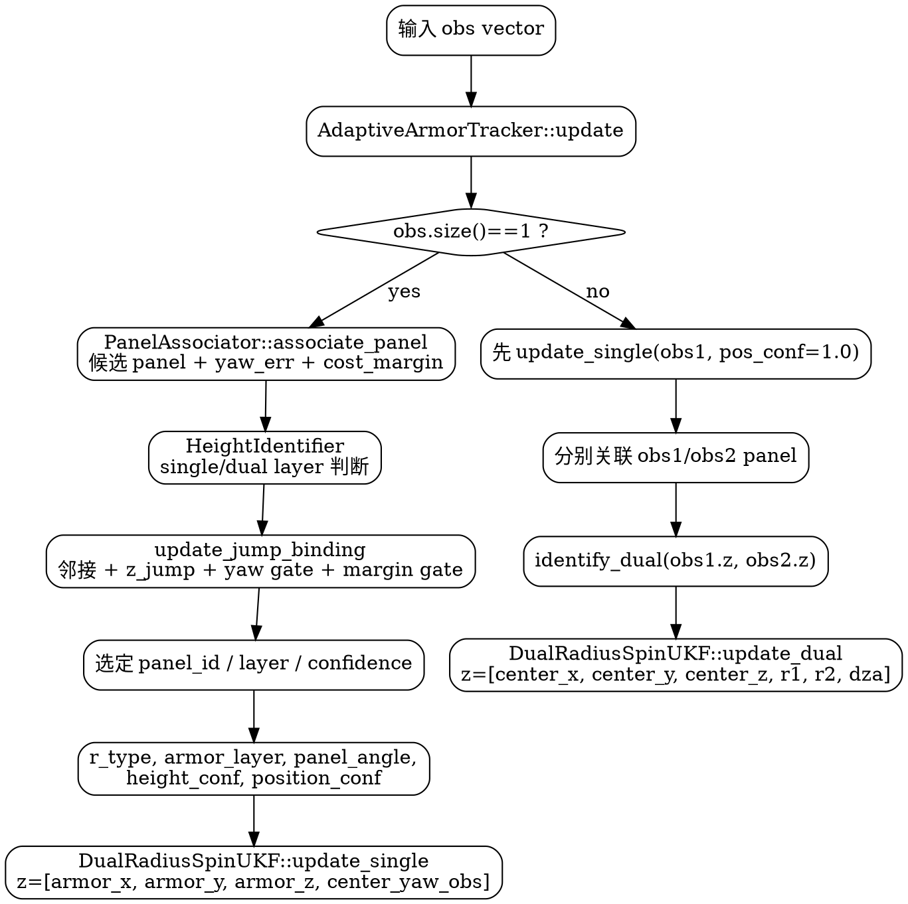
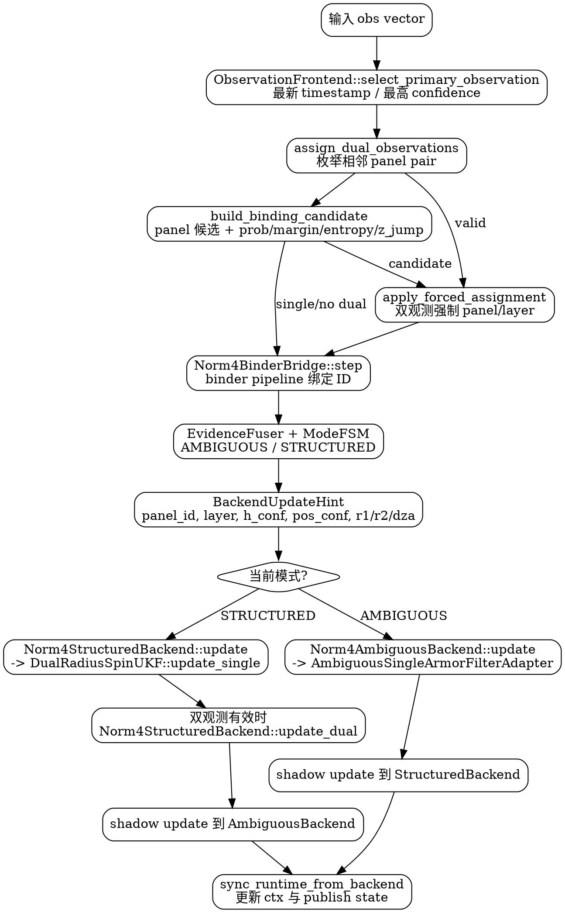
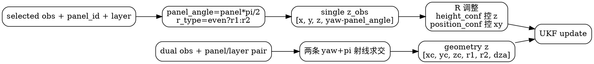

# AdaptiveArmorTracker 与 Norm4ArmorTracker 观测关联及 KF 观测生成调研

## 1. 调研对象与结论摘要

调研对象：

- `include/max_entropy_tracker/trackers/adaptive_armor_tracker.hpp`
- `src/max_entropy_tracker/trackers/adaptive_armor_tracker.cpp`
- `include/max_entropy_tracker/trackers/norm_4armor_tracker.hpp`
- `src/max_entropy_tracker/trackers/norm_4armor_tracker.cpp`
- `trackers/norm4_v2/*`
- `association/panel_associator.hpp`
- `filters/dual_radius_spin_ukf.*`

核心结论：

1. `AdaptiveArmorTracker` 是单类编排：`PanelAssociator` 直接给出候选 panel，`HeightIdentifier` 或 jump binding 给出 layer，然后直接调用 `DualRadiusSpinUKF::update(...)`。
2. `Norm4ArmorTracker` 是分层编排：`ObservationFrontend` 生成候选，`Norm4BinderBridge` 通过 binder pipeline 做 ID 绑定，`EvidenceFuser + ModeFSM` 决定 `AMBIGUOUS/STRUCTURED` 后端，再用 `BackendUpdateHint` 生成后端观测。
3. 两者在结构化后端最终都落到 `DualRadiusSpinUKF`：
   - 单观测：KF 观测向量为 `[armor_x, armor_y, armor_z, center_yaw_obs]`，其中 `center_yaw_obs = obs.yaw - panel_angle`。
   - 双观测：先用两块装甲板 yaw 反向射线求中心，再构造几何观测 `[center_x, center_y, center_z, r1, r2, dza]`。
4. `Norm4ArmorTracker` 额外维护 `AMBIGUOUS` 单板后端。该后端直接跟踪单块装甲板，再利用 `panel_id / radius / layer / dza` 反推机器人中心，用于不确定阶段的降级输出。

## 2. 公共基础：PanelAssociator 如何做 panel 关联

`PanelAssociator::associate_panel(...)` 是两条链路的共同核心。

### 2.1 无中心 yaw 预测的第一帧

当 `center_yaw_pred` 为空时，它直接将观测装甲板 yaw 量化到 4 个 panel：

```text
panel_id = round(normalized(armor_yaw) / (pi/2)) % 4
center_yaw = armor_yaw - panel_id * pi/2
```

这也是 tracker 初始化阶段获得初始 `panel_id` 的基础。

### 2.2 有预测时的候选代价

有预测中心 yaw 时，对 0~3 每个 panel 计算：

```text
expected_yaw(pid) = center_yaw_pred + pid * pi/2
yaw_err = abs(normalize(obs.yaw - expected_yaw))
cost = yaw_err
```

如果传入了中心位置、半径和观测位置，则加入位置误差：

```text
pred_xy(pid) = center_xy + radius(pid) * [cos(expected_yaw), sin(expected_yaw)]
pos_err = norm(obs_xy - pred_xy)
cost = yaw_err + 2.0 * pos_err
```

其中偶数 panel 使用 `r1`，奇数 panel 使用 `r2`。

### 2.3 辅助机制

`PanelAssociator` 还包含三类辅助：

1. z 辅助：当有 `z_obs` 和 `center_z` 时，可用上下层偏好修正 yaw-only 候选。
2. 模糊回退：当 yaw 误差大且 best/second 成本接近时，用位置误差或上一次 confident panel 打破平局。
3. 周期 dz 先验：启用 `periodic_binding_enable` 后，用上一次 z、上一 confident panel、yaw rate 方向和 `dza` 对候选 cost 加轻量先验。

输出诊断 `AssociationDiagnostics` 中的 `selected_yaw_err / cost_margin / best_cost / second_cost` 后续会被 binding 置信度、mode evidence 使用。

## 3. AdaptiveArmorTracker 链路

### 3.1 初始化

`AdaptiveArmorTracker::initialize(...)` 取第一条观测：

1. `panel_associator_.associate_panel(o.yaw, nullopt)` 得到初始 `panel_id` 和 `center_yaw`。
2. `ukf_.initialize(obs, r1, r2, dza, panel_id)` 初始化 `DualRadiusSpinUKF`。
3. `reset_jump_binding(panel_id, default_label_from_panel(panel_id), o.z, o.timestamp)` 初始化绑定状态。

默认 layer 规则：

```text
panel 0/2 -> LOWER -> "lower" -> r1
panel 1/3 -> UPPER -> "upper" -> r2
```

### 3.2 单观测数据关联

`update_single(obs)` 的主路径：

1. 从 UKF 状态取 `center_yaw / center_xyz / r1 / r2 / yaw_rate / dza` 作为关联先验。
2. 调 `PanelAssociator::associate_panel(...)` 得到 `candidate_panel` 和诊断信息。
3. 调 `HeightIdentifier::identify_single(...)`，根据 `obs.z / candidate_panel / center_z / dza` 判断上下层。
4. 如果开启 `jump_binding_enable`，进入 `update_jump_binding(...)`；否则直接信任候选。

`update_jump_binding(...)` 的切换门限包含：

- 候选 panel 与当前 bound panel 必须相邻；
- 当前 z 与上一帧 z 的跳变量级必须超过 `jump_binding_z_jump_min`；
- 如果已经学到 `dz_jump_est_`，跳变量级还需匹配 EMA；
- `selected_yaw_err <= jump_binding_yaw_err_gate`；
- `cost_margin >= jump_binding_cost_margin_min`；
- 连续满足 `jump_binding_confirm_frames` 后才确认切换，并进入 cooldown。

确认切换后，通过 z 跳变方向解析层：

```text
z_jump > +dz_gate -> UPPER
z_jump < -dz_gate -> LOWER
否则 fallback 到 panel 默认层
```

### 3.3 单观测如何生成 UKF 观测

选定 `panel_id / layer` 后：

```text
r_type = panel_id even ? "r1" : "r2"
armor_layer = selected layer, UNKNOWN 时 fallback 到 panel 默认层
panel_angle = panel_id * pi/2
height_conf = max(resolved_height_conf, bound_confidence)
pos_conf = compute_position_confidence(layer, height_conf, r_type)
```

然后调用：

```cpp
ukf_.update({obs}, {r_type}, {armor_layer},
            height_conf, pos_conf, panel_angle);
```

在 `DualRadiusSpinUKF::update_single(...)` 内部，真正的 KF 观测为：

```text
z_obs = [obs.x, obs.y, obs.z, normalize(obs.yaw - panel_angle)]
```

预测观测由状态中的中心位置、yaw、半径和 layer 生成。`height_conf < 0.3` 会显著放大 z 观测噪声；`position_conf < 0.8` 会放大 x/y 观测噪声。单观测更新时，`R1/R2/DZA` 的 Kalman gain 行被置零，因此单板观测不直接更新结构参数。

### 3.4 双观测数据关联与 UKF 观测

`AdaptiveArmorTracker::update_dual(obs1, obs2)` 当前是两段式：

1. 先对 `obs1` 执行一次 `update_single(obs1, 1.0)`。
2. 再分别对 `obs1/obs2` 重新关联 panel，得到 `pid1/pid2`。
3. `HeightIdentifier::identify_dual(obs1.z, obs2.z)` 判断两块板上下层。
4. 调用：

```cpp
ukf_.update({obs1, obs2}, {rt1, rt2}, {l1, l2}, h_conf);
```

`DualRadiusSpinUKF::update_dual(...)` 不再使用 `[armor_xyz, yaw]`，而是先做几何重建：

1. 两条从装甲板指向中心的射线：

```text
yaw_to_center_i = obs_i.yaw + pi
```

2. 求两条射线交点作为中心 `x_center/y_center`。
3. 由交点到两块装甲板的距离估计 `r1/r2`。
4. 如果上下层不同：

```text
dza_est = abs(z1 - z2) / 2
z_center = (z1 + z2) / 2
```

5. 如果同层，则保持当前 `dza`，用该层反推出中心 z。

最终几何观测：

```text
z_geometry = [x_center, y_center, z_center, r1_est, r2_est, dza_est]
```

双观测可以更新结构参数；当高度置信度不足时，会冻结或弱化 `DZA` 更新。

## 4. Norm4ArmorTracker 链路

### 4.1 模块分层

`Norm4ArmorTracker` 将旧式单类职责拆成：

- `ObservationFrontend`：主观测选择、panel 候选、双观测 assignment；
- `Norm4BinderBridge`：将候选转换为 binder pipeline 输入，输出 bound id 和 binding 置信度；
- `EvidenceFuser + ModeFSM`：决定使用 `AMBIGUOUS` 还是 `STRUCTURED`；
- `Norm4AmbiguousBackend`：单板不确定后端；
- `Norm4StructuredBackend`：结构化 `DualRadiusSpinUKF` 后端；
- `Norm4OutputAdapter`：发布状态适配。

### 4.2 主观测选择

`ObservationFrontend::select_primary_observation(...)` 规则较简单：

1. 优先选择 timestamp 最新的观测；
2. 如果都没有 timestamp，则选择 `confidence` 最高的观测。

双观测情况下，之后还会通过 `assign_dual_observations(...)` 修正 primary 与当前 bound panel 的对应关系。

### 4.3 单观测候选生成

`build_binding_candidate(obs, ctx)` 调用 `infer_panel_for_observation(...)`，本质仍是 `PanelAssociator::associate_panel(...)`。

候选中记录：

```text
candidate_panel_id
candidate_height_label = panel 默认上下层
height_confidence ~= cost_margin / jump_binding_cost_margin_min
selected_yaw_err
selected_xy_residual
candidate_prob / candidate_margin / entropy_norm
z_jump = obs.z - ctx.last_obs_z
```

其中 `candidate_prob` 并不是检测器概率，而是由 best/other 代价裕度软构造出的 4 panel 归一化置信表达，用于 binder 和 mode evidence。

### 4.4 双观测 assignment

当 `obs.size() >= 2` 时，`assign_dual_observations(obs0, obs1, ctx)` 枚举相邻 panel 组合 `(p1, p2)`：

1. 每个观测到每个 panel 的单项 cost：

```text
yaw_err + 2.0 * xy_err + 2.0 * z_state_err
```

2. 只允许相邻 panel；
3. 如果两观测 z 差超过 `0.015`，将高 z 观测强约束为 upper，低 z 为 lower，不匹配的组合加惩罚；
4. 选 cost 最小的 assignment，输出两块观测各自的 `panel_id / label / layer / height_confidence`。

若双观测 assignment 有效，Norm4 会把 primary 观测强制改成当前 bound panel 对应的那块；同时调用 `apply_forced_assignment(...)` 提高候选置信：

```text
candidate_prob >= 0.85
candidate_margin >= 0.50
entropy_norm <= 0.35
height_confidence >= 0.80
```

这使双观测成为进入结构模式和稳定绑定的重要证据。

### 4.5 BinderBridge 如何做绑定

`Norm4BinderBridge::step(...)` 将 `BindingCandidate` 和当前上下文转换成 `BinderFrameInput`：

```text
candidate_id
candidate_prob
candidate_margin
obs_z_values / obs_yaw_values
obs_panel_ids / obs_height_labels
z_jump / has_z_jump
yaw_rate_est / spin_direction_hint
selected_yaw_err / cost_margin / same_panel_residual
event_type: CONTINUITY / SWITCH_CANDIDATE / REACQUIRE / AMBIGUOUS
```

binder pipeline 输出：

```text
selected_id
bound_id
pending_id
height_label
binding_confidence
binding_conflict_for_update
fsm_state
switch_reason
```

Norm4 的实际 selected panel 选择逻辑：

1. 优先 `binder_out.selected_id`；
2. 如果 FSM 为 `PENDING_SWITCH` 且有 `pending_id`，使用 pending id；
3. 否则退回 `candidate_panel_id`；
4. 仍无效则退回 `ctx_.selected_panel_id`。

最终 selected label：

1. 优先 `binder_out.height_label`；
2. 其次 `candidate.candidate_height_label`；
3. 最后 panel 默认层。

高度置信度：

```text
height_confidence = max(candidate.height_confidence,
                        binder_out.binding_confidence)
```

### 4.6 ModeFSM 与后端选择

`EvidenceFuser` 消费：

- 观测数量；
- candidate panel；
- 是否有高置信 dz jump；
- entropy/max_prob；
- candidate margin；
- binder debug。

`ModeFSM` 输出 `TrackMode`。Norm4 当前有两个模式：

- `AMBIGUOUS`：绑定证据不足时，主后端是单板 tracker；
- `STRUCTURED`：绑定足够稳定后，主后端是 `DualRadiusSpinUKF`。

切模式时，会用当前 selected observation、selected panel 以及 `ctx_.r1/r2/dza` reset 目标后端。

### 4.7 Norm4 如何生成后端观测

Norm4 统一先生成 `BackendUpdateHint`：

```text
hint.panel_id = selected_panel
hint.height_label = selected_label
hint.height_confidence = height_confidence
hint.position_confidence = max(0.05, binder_out.binding_confidence)
hint.r1_hint = ctx_.r1
hint.r2_hint = ctx_.r2
hint.dza_hint = ctx_.dza
hint.enforce_panel_constraint = true
```

如果 binder 认为本帧存在绑定冲突：

```text
position_confidence *= 0.35，并 clamp 到 [0.05, 1.0]
```

#### STRUCTURED 模式

主更新：

```cpp
structured_backend_.update(*selected, hint);
```

`Norm4StructuredBackend` 将 hint 翻译为：

```text
r_type = panel_id even ? "r1" : "r2"
layer = hint.height_label -> "upper/lower"，UNKNOWN 时用 panel 默认层
panel_angle = panel_id * pi/2
```

然后调用：

```cpp
ukf_.update({obs}, {r_type}, {layer},
            height_confidence, position_confidence, panel_angle);
```

如果双观测 assignment 有效，随后再补一次结构化双观测更新：

```cpp
structured_backend_.update_dual(obs0, obs1,
                                panel_id_1, panel_id_2,
                                layer_1, layer_2,
                                height_confidence);
```

同时 `ambiguous_backend_` 会以较低 `position_confidence` 做 shadow update，保证模式回退时有连续状态。

#### AMBIGUOUS 模式

主更新：

```cpp
ambiguous_backend_.update(*selected, hint);
```

`Norm4AmbiguousBackend` 不调用 `DualRadiusSpinUKF`，而是调用 `AmbiguousSingleArmorFilterAdapter`：

```cpp
filter_.update(obs, pos_conf, pos_conf);
```

它直接跟踪单块装甲板的 `armor_pos / armor_vel / armor_yaw / armor_yaw_rate`。随后用 hint 中的 `panel_id / r1 / r2 / dza / height_label` 反推中心：

```text
radius = panel even ? r1_hint : r2_hint
center_xy = armor_xy - radius * [cos(armor_yaw), sin(armor_yaw)]
center_z = armor_z - panel_z_offset(panel_id, height_label)
center_yaw = armor_yaw - panel_angle(panel_id)
```

同时 `structured_backend_` 也会做低权重 shadow update；若双观测有效，仍会给 structured backend 补双观测，方便后续切入 `STRUCTURED`。

## 5. Graphviz 流程图

### 5.1 AdaptiveArmorTracker



### 5.2 Norm4ArmorTracker



### 5.3 结构化 UKF 观测生成



## 6. 两个 tracker 的关键差异

| 维度 | AdaptiveArmorTracker | Norm4ArmorTracker |
|------|----------------------|-------------------|
| 编排方式 | 单类内直接串联关联、绑定、KF | 前端、binder、mode、backend 分层 |
| 单观测 panel 来源 | `PanelAssociator` 候选，可被 jump binding 覆盖为 bound panel | `ObservationFrontend` 候选，再由 binder output / pending id 决定 |
| 高度层来源 | `HeightIdentifier` + jump 方向解析 | 默认 panel 层、双观测 z 强约束、binder height label |
| 置信度用途 | `height_conf` 与 `pos_conf` 直接调 UKF 噪声 | binder confidence 进入 `BackendUpdateHint`，冲突时降低 pos_conf |
| 双观测 | 先单更 obs1，再双更 obs1/obs2 | 双观测 assignment 可强制 candidate，并补 structured dual update |
| 后端模式 | 只有结构化 `DualRadiusSpinUKF` | `AMBIGUOUS` 单板后端 + `STRUCTURED` UKF，互为 shadow |
| 模糊处理 | jump binding 状态机 + mismatch correction | binder FSM + ModeFSM + ambiguous backend |

## 7. 对 Norm4 优化的启示

1. `Norm4` 已经把“观测关联”和“KF 观测生成”拆开，优化时应优先保持这个边界：前端负责候选与 assignment，binder 负责 ID 稳定性，backend 只消费 `BackendUpdateHint`。
2. `assign_dual_observations` 是 Norm4 当前最强结构证据入口。后续若要提升双板帧表现，可优先扩展这里的 cost 设计，例如纳入检测置信度、装甲板类别、投影尺寸或重投影残差。
3. `position_confidence = binder_confidence` 是连接 binder 与 KF 的关键软门控。当前冲突帧乘 0.35，语义清晰；可考虑将 yaw_err、xy_residual、entropy 也折算进 pos_conf，而不是只依赖 binder confidence。
4. `Adaptive` 的 `HeightIdentifier` 在单观测链路中仍比 Norm4 的默认层更主动。Norm4 若单板长期运行，可考虑在 `ObservationFrontend::build_binding_candidate` 中引入类似 `HeightIdentifier` 的单观测层置信，而不是仅使用 panel 默认层。
5. `Adaptive::update_dual` 会先对 obs1 单更，再做双更；Norm4 则先用双观测 assignment 提升候选，再在结构化后端补 dual update。Norm4 的顺序更适合分层架构，但需要关注 shadow update 后端是否会被低置信单板先验长期拖偏。
6. 对下层 KF 来说，最危险的不是 raw obs，而是错误的 `panel_angle / r_type / layer`。因此调试 Norm4 时应优先记录：`candidate_panel_id`、`binder_out.selected_id/pending_id/bound_id`、`selected_label`、`height_confidence`、`position_confidence` 和最终后端模式。

