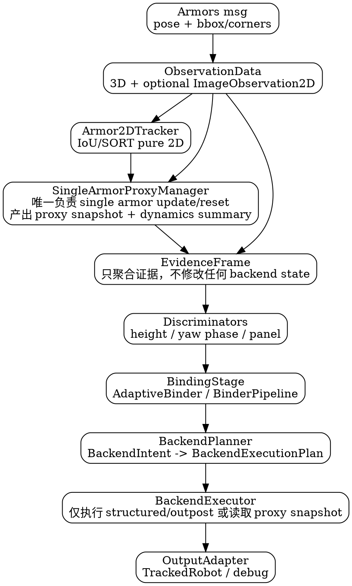

# max_entropy_tracker 通用证据 Pipeline 与 2D Tracker 早期接入设计

## 1. 设计结论

前一版 `Norm4ArmorTracker` 串行 Pipeline 方案不应只服务 Norm4。更合理的方向是把它上升为 `max_entropy_tracker` 的通用内部架构，让 `AdaptiveArmorTracker`、`Norm4ArmorTracker`、`OutpostArmorTracker`、`OutpostTrackerV2` 都能共享：

```text
FrameInput
→ 2D Track Evidence
→ SingleArmor Proxy Trackers
→ 3D Track Evidence
→ Geometry / Relation Evidence
→ Panel / Armor Discriminator
→ Binding Stage
→ Mode / Backend Decision
→ Backend Command
→ Backend Manager
→ Output Adapter
→ Debug Trace
```

其中 2D tracker 应该尽早进入主链路，因为它解决的问题与 3D panel 绑定不同：

```text
2D track_id：当前帧检测是否延续上一帧同一块可见装甲板
panel_id：该可见装甲板在机器人结构中的 0/1/2/3 等候选编号
armor_id / number：业务语义上的装甲编号
robot_track_id：完整机器人对象轨迹
```

2D tracker 不直接决定 `panel_id`，但可以显著降低“同一块装甲板被错误匹配成另一块”的概率，并为后续 single-armor 3D 跟踪、遮挡重获、双板关系提供稳定的短时实例身份。

进一步地，建议前期就实现 tracker 代理模式：

```text
每个 confirmed / active Track2DId
  ↔  一个 AmbiguousSingleArmorFilterAdapter 代理后端
```

2DTracker 只维护 2D 连续性；与该 2D track 对应的 3D 单装甲板状态由 `SingleArmorProxyManager` 维护。这样 `AMBIGUOUS` 模式可以直接发布已有 single armor tracker 的状态，而不是临时初始化 ambiguous backend。

## 2. 现有可复用基础

### 2.1 armor_detector_nn

`armor_detector_nn` 已经具备一套轻量 2D association：

- `ArmorDetection`：包含 `bbox / keypoints / center / confidence / track_id / track_age / track_hits`；
- `InternalIoUTrackerStrategy`：IOU + center distance gate + Hungarian；
- `TrackState`：维护 `id / predicted_bbox / center / age / hits / missed / velocity / confirmed`；
- 配置：`iou_threshold / max_missed / min_hits / max_center_dist_px`。

这套实现贴近装甲检测数据结构，适合迁移或抽取到 `max_entropy_tracker/tracking2d`。

### 2.2 muit_obj_tracker

`muit_obj_tracker` 已有：

- `SortTracker`：Kalman + IOU + Hungarian；
- `PointTracker`：点距离 + Hungarian + KF；
- `Detection / TrackResult` 数据模型；
- 多种 KF 配置和测试脚本。

它更适合作为第二阶段增强版 2D tracker 的参考：当 internal IOU 对高速运动、短时遮挡不够稳时，引入 SORT/KF 预测。

### 2.3 当前缺口

`rm_interfaces/msg/Armor.msg` 当前只有：

```text
string number
string type
float32 distance_to_image_center
geometry_msgs/Pose pose
```

`gimbal_pipeline` 中 `ObservationData` 当前也只有 3D 位姿、yaw、confidence、timestamp 等字段。因此如果 2D tracker 放在 `max_entropy_tracker` 内部，需要先把图像域几何带到 gimbal_pipeline。

## 3. 总体架构定位

建议在 `include/max_entropy_tracker` 下新增通用层，而不是放到 `trackers/norm4_v2`：

```text
include/max_entropy_tracker/
  core/
    observation.hpp              // 扩展 2D metadata
    frame.hpp                    // FrameInput / FrameSnapshot
    ids.hpp                      // Track2DId / PanelId / RobotTrackId / ArmorId
  tracking2d/
    armor_2d_types.hpp
    armor_2d_tracker.hpp
    iou_2d_tracker.hpp
    sort_2d_tracker_adapter.hpp  // 可选，适配 muit_obj_tracker
  single_armor/
    single_armor_proxy.hpp
    single_armor_proxy_manager.hpp
  evidence/
    evidence_frame.hpp
    observation_evidence_builder.hpp
    geometry_evidence.hpp
    relation_evidence.hpp
    quality_evidence.hpp
  discriminator/
    panel_discriminator.hpp
    height_discriminator.hpp
    yaw_phase_discriminator.hpp
    armor_id_discriminator.hpp
  pipeline/
    serial_tracker_pipeline.hpp
    backend_command.hpp
    backend_manager.hpp
    debug_trace.hpp
  association/
    adaptive_armor_binder.hpp    // 已有，可作为 BindingStage 核心之一
  trackers/
    adaptive_armor_tracker.hpp
    norm_4armor_tracker.hpp
    outpost_armor_tracker.hpp
```

`trackers/*` 只保留机器人类型相关的策略组合和 BaseTracker 外壳；通用证据、2D track、binding、debug 类型放在上层目录共享。

### 3.1 Tracker 家族共址约定（先共址，后清理）

在功能稳定前，`Armor2DTracker / Armor3DTracker / RobotTracker` 三类实现先按当前项目结构共址，避免跨项目拆分带来的调试成本：

```text
include/max_entropy_tracker/
  tracking2d/          # Armor2DTracker + manager + filter
  tracking3d_single/   # Armor3DTracker(single armor) + manager + filter
  tracking3d_robot/    # RobotTracker(structured robot) + manager + filter
  pipeline/            # BackendPlanner / BackendExecutor
```

对位关系：

```text
Armor2DTracker: IoUArmor2DTracker / SortArmor2DTracker
Armor3DTracker: AmbiguousSingleArmorFilterAdapter（通过 adapter 纳入）
RobotTracker: DualRadiusSpinUKF / OutpostSpinUKF（通过 adapter 纳入）
```

约束：

```text
先在 max_entropy_tracker 内共址组织，后续功能稳定后再做目录清理与命名收敛。
```

## 4. 当前已有实现调研与复用清单

本次架构不应重写已有成熟能力，而是把它们组织成可复用模块。当前 `include/max_entropy_tracker` 中可直接参考或复用的设计如下。

| 模块 | 现有文件 | 可复用点 | 新架构中的位置 |
|---|---|---|---|
| 生命周期外壳 | `trackers/base_tracker.hpp` | `INITIALIZING/TRACKING/TEMP_LOST/LOST` 状态机、时间同步、`BaseTracker` 对外接口 | 保持不变，Norm4 外壳继续继承 |
| per-robot 管理 | `tracker_manager.hpp` | robot_id 到 `BaseTracker` 的资产管理、predict/update/remove、后处理缓存 | 前期不改，只让其可选择创建新 Norm4 |
| 4板几何关联 | `association/panel_associator.hpp` | yaw/xy/radius 联合 cost、周期 dz 先验、diagnostics | `GeometryEvidenceBuilder` 内复用 |
| 高度判别 | `association/height_identifier.hpp` | 单观测 `z_mean/dza` 判上下层、双观测 z 排序 | `HeightDiscriminator` 内复用 |
| panel 错配修正 | `association/panel_mismatch_detector.hpp` | 基于 z residual 窗口的 patch/reinit 建议 | Norm4 结构化后端后处理复用 |
| 通用绑定状态机 | `association/adaptive_armor_binder.hpp` | panel-count agnostic、PROXIMITY/COST、periodic evidence、debug snapshot | 轻量 BindingStage 可直接包装 |
| binder pipeline | `binder/pipeline/binder_pipeline.hpp` + `binder/*` | decoder/id_binder/scorer/FSM 分层、`BinderFrameInput/Output`、debug | Norm4/Outpost 风格 BindingStage 复用 |
| robot profile | `binder/model/robot_binding_profile.hpp` | panel 数、z offset、机器人类型 profile | `RobotProfile` / BindingStage 输入 |
| 模式决策 | `mode/evidence_fuser.hpp`、`mode/mode_fsm.hpp` | `ModeEvidence -> ModeDecision`、滞回与 dwell | `ModeDecider` 直接复用 |
| 单装甲板后端 | `filters/ambiguous_single_armor_filter_adapter.hpp` | legacy KF / IMM adapter、`armor_pos/vel/yaw/yaw_rate` | `SingleArmorProxyManager` 的每 track 后端 |
| 结构化 4板后端 | `filters/dual_radius_spin_ukf.hpp` | 单/双观测 UKF、r1/r2/dza、NIS/innovation | Norm4 structured backend 保持使用 |
| 前哨站后端 | `filters/outpost_spin_ukf.hpp` | 3板结构化后端 | 前期不改，仅作为通用 backend command 的兼容目标 |
| Norm4 v2 拆分经验 | `trackers/norm4_v2/*` | frontend/binder/mode/backend/output 的已有分层 | Norm4 新 pipeline 的主要迁移来源 |
| Outpost v2 拆分经验 | `trackers/outpost_v2/*` | candidate/binder/backend/output 类似分层 | 作为设计参考，不在前期改动 |
| 输出后处理 | `utils/output_smoother.hpp`、`observation_outlier_filter.hpp` | 不侵入 tracker 内部状态的输出滤波、outlier hold | 保持在 `TrackerManager::post_process_output` |
| 机动检测 | `utils/maneuver_detector.hpp` | NIS/innovation 分 update_type 检测 | Norm4 debug 与 mode evidence 可读取 |

### 4.1 应直接采用的设计

1. **外壳不变**：继续使用 `BaseTracker` 和 `TrackerManager` 的生命周期模型，避免影响稳定 tracker。
2. **绑定不重写**：轻量 4板绑定优先包装 `AdaptiveArmorBinder`；复杂绑定优先包装 `BinderPipeline`。
3. **模式不重写**：直接复用 `EvidenceFuser + ModeFSM`。
4. **single armor 后端不重写**：`SingleArmorProxyManager` 内部直接持有 `AmbiguousSingleArmorFilterAdapter`。
5. **结构化 UKF 不重写**：Norm4 继续通过 `DualRadiusSpinUKF` 完成结构化更新。

### 4.2 不在前期改动的稳定实现

前期修改范围只包含：

```text
新增 max_entropy_tracker 通用模块
新增 / 改造 Norm4ArmorTracker 的内部实现
必要的 msg_converter / ObservationData 2D metadata 打通
```

明确不改动：

```text
AdaptiveArmorTracker 当前主链路
OutpostArmorTracker 当前主链路
OutpostTrackerV2 当前主链路
TrackerManager 的生命周期策略
DualRadiusSpinUKF / OutpostSpinUKF / AmbiguousSingleArmorFilterAdapter 核心滤波算法
OutputSmoother / ObservationOutlierFilter 后处理链路
```

这些模块只作为设计参考或被 Norm4 新链路调用；不进行行为重构，降低实车风险。

## 5. ID 语义约定

必须在 `core/ids.hpp` 中显式定义：

```cpp
using DetectionId = int;
using Track2DId = int;
using Track3DId = int;
using RobotTrackId = int;
using PanelId = int;
using ArmorId = int;
```

约束：

```text
DetectionId 只在当前帧有效。
Track2DId 表示图像域短时连续实例。
PanelId 表示机器人结构模型中的候选面板编号。
ArmorId 表示业务层装甲编号。
RobotTrackId 表示完整机器人 tracker 资产。
```

禁止：

```text
Track2DId == PanelId
Track2DId == ArmorId
detector number 字段承载 track_id
```

## 6. ObservationData 扩展建议

为兼容当前所有 tracker，`ObservationData` 可以 append-only 增加可选 2D 字段：

```cpp
struct ImageObservation2D {
  bool valid = false;
  int detection_id = -1;

  double bbox_x = 0.0;
  double bbox_y = 0.0;
  double bbox_w = 0.0;
  double bbox_h = 0.0;

  std::array<Eigen::Vector2d, 4> corners{};
  double image_center_x = 0.0;
  double image_center_y = 0.0;

  double detection_confidence = 0.0;
  std::string number;
  std::string type;
};

struct ObservationData {
  double x = 0.0;
  double y = 0.0;
  double z = 0.0;
  double yaw = 0.0;

  std::optional<int> panel_id;
  std::optional<std::string> layer;
  double confidence = 1.0;
  std::optional<double> timestamp;

  std::optional<ImageObservation2D> image;
  std::optional<int> track2d_id;
};
```

这样旧 tracker 不受影响，新 pipeline 可以读取 2D evidence。

## 7. Armor.msg 扩展建议

为了让 gimbal_pipeline 真正拿到 2D 证据，建议 `rm_interfaces/msg/Armor.msg` append-only 增加：

```text
float32 detection_confidence
bool has_image_geometry
float32[4] bbox_xywh
geometry_msgs/Point32[4] image_corners
uint8 corners_ordering
```

可选字段：

```text
int32 detector_track_id       # 不推荐第一阶段启用；若存在，仅作为 detector 内部 debug
int32 detector_track_age
int32 detector_track_hits
```

推荐第一阶段不依赖 detector 发布的 `track_id`，而是在 `max_entropy_tracker` 内部重新跑 2D tracker。理由：

1. detector 保持无状态或弱状态；
2. gimbal_pipeline 可以统一融合 2D/3D/TF 后证据；
3. 避免 detector 侧 track_id 生命周期和 tracker 侧生命周期耦合；
4. bag 回放和 A/B 调参更可控。

如果 `armor_detector_nn` 已经输出 track_id，也可以作为 debug 或先验，但不应作为硬约束。

## 8. 通用 2D Tracker 设计

### 8.1 接口

```cpp
struct Armor2DDetection {
  DetectionId detection_id = -1;
  double timestamp = 0.0;

  double bbox_x = 0.0;
  double bbox_y = 0.0;
  double bbox_w = 0.0;
  double bbox_h = 0.0;
  std::array<Eigen::Vector2d, 4> corners{};

  double confidence = 0.0;
  std::string number;
  std::string type;

  // 对应的 3D 观测索引，用于回填 evidence
  int observation_index = -1;
};

struct Armor2DTrackEvidence {
  bool valid = false;
  Track2DId track_id = -1;
  int observation_index = -1;

  double association_quality = 0.0;
  bool confirmed = false;
  int age = 0;
  int hits = 0;
  int missed = 0;

  double center_x = 0.0;
  double center_y = 0.0;
  double velocity_x = 0.0;
  double velocity_y = 0.0;
};

class IArmor2DTracker {
 public:
  virtual ~IArmor2DTracker() = default;
  virtual std::vector<Armor2DTrackEvidence> update(
      const std::vector<Armor2DDetection>& detections,
      double timestamp) = 0;
  virtual void reset() = 0;
};
```

约束：

```text
2DTracker 只消费 bbox/corners/confidence/number/type/timestamp。
2DTracker 不读取 obs.x/y/z/yaw。
2DTrackEvidence 不维护 z_mean/z_var。
2DTracker 不直接 initialize/update SingleArmor tracker。
```

### 8.2 第一阶段实现

优先实现 `IoUArmor2DTracker`，基本照搬 `armor_detector_nn::InternalIoUTrackerStrategy` 的逻辑：

```text
预测 bbox：上一 bbox + velocity * dt
预门控：IOU >= threshold 且 center_dist <= max_center_dist_px
匹配：Hungarian
更新：hits/age/missed/velocity/confirmed
新建：unmatched detection
删除：missed > max_missed
```

新增两点：

1. 输出 `association_quality = max(iou_score, center_score weighted)`；
2. 输出纯 2D 速度、age/hits/missed/confirmed，供后续 3D 代理管理器使用。

### 8.3 第二阶段实现

引入 `SortArmor2DTracker`，复用或适配 `muit_obj_tracker::SortTracker`：

```text
Kalman 预测中心点
IOU + center distance 联合代价
Hungarian 匹配
输出 TrackResult -> Armor2DTrackEvidence
```

建议不要直接让 `max_entropy_tracker` 强依赖 `muit_obj_tracker` 的现有 CMake 目标，先做 adapter 层，允许后续替换。

## 9. SingleArmor Proxy Manager

### 9.1 设计目标

`AmbiguousSingleArmorFilterAdapter` 不应只作为 Norm4/Outpost 的 ambiguous fallback，而应成为通用 single-armor track 后端：

```text
Track2DId 提供图像域连续身份
ObservationData 提供该身份对应的 3D 测量
AmbiguousSingleArmorFilterAdapter 维护单装甲板 3D 状态
```

由 `SingleArmorProxyManager` 统一维护：

```cpp
struct SingleArmorProxy {
  Track2DId track_id = -1;
  AmbiguousSingleArmorFilterAdapter filter;

  int age = 0;
  int hits = 0;
  int missed = 0;
  bool confirmed = false;

  std::optional<double> last_timestamp;
};

struct SingleArmorTrackEvidence {
  bool valid = false;
  Track2DId track_id = -1;
  int observation_index = -1;

  Eigen::Vector3d armor_pos = Eigen::Vector3d::Zero();
  Eigen::Vector3d armor_vel = Eigen::Vector3d::Zero();
  double armor_yaw = 0.0;
  double armor_yaw_rate = 0.0;

  bool has_z_stats = false;
  double z_mean = 0.0;
  double z_var = 0.0;
  int z_count = 0;

  double update_confidence = 0.0;
  bool initialized = false;
};
```

这里的 `z_mean/z_var` 属于 3D track evidence，而不是 2D evidence。

### 9.2 更新职责

`SingleArmorProxyManager` 每帧执行：

```text
1. 读取 Armor2DTrackEvidence 与 ObservationData 的匹配关系；
2. 对已有 proxy predict(dt)；
3. matched track 有 3D observation 时 update(obs, pos_conf, yaw_conf)；
4. 新 track 有 3D observation 时创建并 initialize；
5. unmatched proxy missed++，短时保留用于 reacquire；
6. 输出 SingleArmorTrackEvidence。
```

2DTracker 不直接调用 single armor filter；它只输出 `track_id` 与 2D 质量。是否创建、更新、保留或删除 single armor proxy，由 proxy manager 根据 2D track 生命周期、3D 观测质量、BaseTracker 状态和配置决定。

### 9.3 AMBIGUOUS 输出

当结构化绑定证据不足时，`AMBIGUOUS` 模式可以直接选择一个已有 `SingleArmorProxy` 输出：

```text
aim_position = proxy.armor_pos
aim_velocity = proxy.armor_vel
armor_yaw    = proxy.armor_yaw
```

这比当前 Norm4 在 ambiguous backend 中临时 reset/update 更稳，因为单装甲板状态从 2D track 创建开始就连续维护。

### 9.4 给结构化 UKF 的辅助信息

single armor proxy 还可以向结构化后端提供：

```text
armor velocity
armor yaw_rate
short-window z stats
single armor innovation / quality
track lifecycle confidence
```

这些信息后续可进入 `BackendIntent / BackendExecutionPlan` 或 UKF update 的噪声调度：

```text
position_confidence
yaw_confidence
height_confidence
velocity prior / maneuver evidence
```

第一阶段不建议直接把 proxy velocity 作为 UKF 强观测，可以先作为 soft prior 或 debug 指标。

## 10. 通用 EvidenceFrame

每个 tracker 类型都消费同一个 evidence frame：

```cpp
struct ArmorObservationEvidence {
  int observation_index = -1;
  ObservationData obs;

  std::optional<Armor2DTrackEvidence> track2d;
  std::optional<SingleArmorTrackEvidence> single_armor;

  int geometric_panel_id = -1;
  double selected_yaw_err = 0.0;
  double selected_xy_residual = 0.0;
  double cost_margin = 0.0;

  binder::HeightLabel height_label_hint = binder::HeightLabel::UNKNOWN;
  double height_confidence = 0.0;

  double quality = 1.0;
};

struct ArmorRelationEvidence {
  int obs_i = -1;
  int obs_j = -1;
  double z_diff = 0.0;
  double xy_distance = 0.0;
  double yaw_diff = 0.0;
  double relation_confidence = 0.0;
};

struct ArmorEvidenceFrame {
  double timestamp = 0.0;
  std::vector<ArmorObservationEvidence> observations;
  std::vector<ArmorRelationEvidence> relations;
};
```

通用 builder 顺序：

```text
ObservationData[] + image geometry
→ Armor2DDetection[]
→ IArmor2DTracker.update()
→ 回填 track2d evidence
→ SingleArmorProxyManager.update()
→ 回填 single armor 3D track evidence
→ 计算 3D 几何 evidence / height evidence
→ 计算双板/多板 relation evidence
→ 输出 ArmorEvidenceFrame
```

## 11. 2D / Proxy evidence 如何降低错误匹配

### 11.1 单观测连续性

如果本帧观测与上一帧同一个 `track2d_id` 连续，则：

```text
候选 panel 不应轻易跳变
除非 3D yaw/z jump/binder 给出强证据
```

可作为 binder 的 soft prior：

```text
same_track_same_panel_score
track_switch_penalty
reacquire_low_confidence
```

### 11.2 single-armor 3D 统计辅助上下层

同一个 `track2d_id` 对应的 `SingleArmorTrackEvidence` 中的短窗 `z_mean/z_var` 可辅助：

```text
单观测 height label 判断
双观测 upper/lower 分配
jump event 是否真实
遮挡重获时是否接回旧 panel
```

例如：

```text
如果 single_armor.z_var 小且 z_obs 接近该 single_armor.z_mean，
则同一 track 不应被解释成另一个高度层。
```

### 11.3 双观测关系

双板场景下，如果两个观测都有稳定 2D track：

```text
Track A/B 对应 single-armor proxy 的历史 z 均值顺序
当前 z 顺序
图像位置连续性
```

可以共同约束 panel pair assignment，避免单帧 3D yaw 误差导致 pair 反转。

## 12. 通用 BindingStage

现有 `AdaptiveArmorBinder` 已经抽象了 proximity/cost 两类策略，可升级为通用 BindingStage 的核心：

```cpp
struct BindingStageInput {
  ArmorEvidenceFrame evidence;
  PanelHypothesis panel_hypothesis;
  BindingMemory memory;
  RobotProfile profile;
};

struct BindingStageOutput {
  int selected_panel_id = -1;
  int bound_panel_id = -1;
  int pending_panel_id = -1;
  binder::HeightLabel height_label = binder::HeightLabel::UNKNOWN;
  double confidence = 0.0;
  bool conflict_for_update = false;
  std::string reason;
};
```

不同 tracker 选择不同策略：

| Tracker | Binding 策略 |
|---|---|
| AdaptiveArmorTracker | 4 panel proximity + z jump |
| Norm4ArmorTracker | 4 panel cost/proximity 混合 + 2D continuity |
| OutpostArmorTracker | 3 panel cost + periodic evidence |
| OutpostTrackerV2 | binder pipeline + mode evidence |

## 13. 通用 Serial Pipeline 模板

建议新增 `pipeline/serial_tracker_pipeline.hpp`，不是模板元编程，而是稳定接口：

```cpp
class IRobotTrackerPipeline {
 public:
  virtual ~IRobotTrackerPipeline() = default;

  virtual void initialize(const std::vector<ObservationData>& obs,
                          double r1, double r2, double dza) = 0;
  virtual void predict(std::optional<double> target_time) = 0;
  virtual bool update(const std::vector<ObservationData>& obs) = 0;

  virtual PipelineSnapshot snapshot() const = 0;
  virtual const PipelineDebugTrace& debug_trace() const = 0;
};
```

典型实现：

```text
AdaptivePipeline
Norm4Pipeline
OutpostPipeline
```

共享组件：

```text
Armor2DTracker
SingleArmorProxyManager
ObservationEvidenceBuilder
GeometryAssociator
HeightDiscriminator
RelationEvidenceBuilder
BindingStage
BackendIntent / BackendExecutionPlan
DebugTrace
```

差异组件：

```text
RobotProfile
Panel count / z offset model
Backend type
Mode policy
Output adapter
```

## 14. BackendCommand 通用化（语义去重版）

为避免与 `SingleArmorProxyManager` 的状态更新语义重叠，建议把“后端决策”拆为两层：

```text
BackendIntent（做什么）
-> BackendExecutionPlan（怎么做）
```

关键边界：

1. `SingleArmorProxyManager` 是 single-armor filter 的唯一 update/reset 拥有者（每帧执行）。
2. backend 决策层不得再次调用 `AmbiguousSingleArmorFilterAdapter::update(...)`。
3. AMBIGUOUS 模式默认“消费 proxy 快照并发布”，而不是“再更新一遍 proxy filter”。

建议数据结构如下。

```cpp
enum class BackendTarget {
  STRUCTURED_4P,   // DualRadiusSpinUKF
  OUTPOST_3P,      // OutpostSpinUKF
  PROXY_SNAPSHOT,  // 从 SingleArmorProxyManager 读取并发布
};

enum class BackendAction {
  HOLD,            // 不更新滤波器，仅保持状态
  UPDATE_SINGLE,   // 结构化后端单观测更新
  UPDATE_DUAL,     // 结构化后端双观测更新
  RESET_THEN_UPDATE,
  PUBLISH_PROXY_ONLY,
};

struct BackendIntent {
  BackendTarget target = BackendTarget::PROXY_SNAPSHOT;
  BackendAction action = BackendAction::HOLD;

  int selected_observation = -1;
  std::vector<int> dual_observation_indices;
  int selected_panel_id = -1;
  std::vector<int> dual_panel_ids;

  binder::HeightLabel height_label = binder::HeightLabel::UNKNOWN;
  std::vector<binder::HeightLabel> dual_height_labels;

  std::optional<Track2DId> source_track2d_id;  // 仅用于读取 proxy snapshot
  double height_confidence = 0.0;
  double position_confidence = 0.0;
  double binding_confidence = 0.0;
  std::string reason;
};

struct BackendExecutionPlan {
  BackendIntent intent;
  bool call_structured_backend = false;
  bool call_outpost_backend = false;
  bool read_proxy_snapshot = false;
  bool publish_only = false;
};
```

执行规则固定为：

```text
if target == PROXY_SNAPSHOT:
  只读取 SingleArmorProxyManager 快照，不调用任何 single armor update

if target == STRUCTURED_4P:
  只调用 DualRadiusSpinUKF，不触碰 proxy filter 状态

if target == OUTPOST_3P:
  只调用 OutpostSpinUKF，不触碰 proxy filter 状态
```

兼容迁移建议：

```text
旧 BackendCommand 可以作为 BackendIntent 的别名过渡，
但禁止再出现 AmbiguousSingleArmorFilterAdapter::update(...) 的 backend 路径。
```

## 15. 对现有 tracker 的迁移方式

### 15.1 AdaptiveArmorTracker

前期不修改实现，仅作为新架构兼容目标。后续如果要接入 2D evidence，也应通过配置开关和 A/B 验证逐步进行：

```text
update(obs)
→ common EvidenceBuilder 跑 2D tracker
→ Adaptive 原有 PanelAssociator / jump_binding
→ binding_confidence 融入 2D continuity soft prior
```

最小收益：

```text
同一 2D track 连续时，抑制 panel_id 非必要跳变。
```

### 15.2 Norm4ArmorTracker

前期唯一实际改造对象。优先改造成通用 pipeline 的第一个试点：

```text
ObservationFrontend 拆为通用 EvidenceBuilder + Norm4 PanelPolicy
BackendUpdateHint 改为 BackendIntent / BackendExecutionPlan
AMBIGUOUS/STRUCTURED 由 BackendExecutor 执行
```

Norm4 最能受益于 2D track，因为它当前 ambiguous 单板反推中心容易受 panel 错配影响。

同时，Norm4 的 `AMBIGUOUS` 模式应优先使用 `SingleArmorProxyManager` 中对应 `track2d_id` 的 single armor tracker 输出，而不是另建一个 tracker 私有 ambiguous backend。结构化模式仍由 `DualRadiusSpinUKF` 输出。

### 15.3 OutpostArmorTracker / OutpostTrackerV2

前期不修改实现，仅记录后续接入 2D track 的价值：

```text
前哨站三板切换时，减少相邻板误接；
z_mean/z_var 可以辅助三层高度 jump audit；
reacquire 后用 track2d continuity 降低错误重绑定概率。
```

## 16. 配置建议

新增配置组：

```yaml
tracker:
  evidence:
    enable_2d_tracker: true
    two_d_tracker_type: "iou"   # iou | sort
    two_d:
      iou_threshold: 0.30
      max_center_dist_px: 120
      min_hits: 2
      max_missed: 15
      velocity_smoothing: 0.30
      continuity_weight: 0.20
      max_prior_weight: 0.35
  single_armor_proxy:
    enable: true
    keep_lost_frames: 10
    min_hits_for_output: 2
    use_for_ambiguous_output: true
    z_stats_min_samples: 3
    z_stats_outlier_gate: 0.15
```

默认建议：

```text
enable_2d_tracker = true
2D evidence 只作为 soft evidence
任何 2D 证据缺失都完全回退当前 3D 逻辑
```

## 17. 分阶段落地计划

### Phase 1：消息与 ObservationData 打通

1. `Armor.msg` append-only 增加 bbox/corners/confidence；
2. `armor_detector_nn` 和旧 detector 尽量统一字段语义；
3. `msg_converter / TFHandler` 将图像几何复制到 `ObservationData::image`；
4. 无 2D 字段时 `image.valid=false`，旧逻辑完全兼容。

### Phase 2：max_entropy_tracker 内置 IoU 2D tracker

1. 新增 `tracking2d/*`；
2. 从 `armor_detector_nn::InternalIoUTrackerStrategy` 迁移核心逻辑；
3. 输出 `Armor2DTrackEvidence`；
4. 仅输出纯 2D evidence：track id、bbox、center、velocity、age/hits/missed、association quality。

### Phase 3：SingleArmorProxyManager（含动力学摘要）

1. 新增 `single_armor/single_armor_proxy_manager.hpp`；
2. 为每个 active Track2DId 维护一个 `AmbiguousSingleArmorFilterAdapter`；
3. 将 z 统计、3D velocity、yaw_rate 等放入 `SingleArmorTrackEvidence`；
4. 增加动力学摘要字段（窗口速度方差、加速度差分、yaw_rate 连续性）；
5. 支持 ambiguous 模式直接从 proxy 输出；
6. 第一版只作为 soft evidence / debug 指标，不作为 UKF 强观测。

### Phase 4：Norm4 相位记忆 + 0101 抑制（首版）

1. 在 Norm4 侧新增 phase sequence memory；
2. 检测 `A B A B` ping-pong 与 `0<->2` / `1<->3` opposite jump；
3. 引入基于 proxy 动力学的 `kinematic_inconsistency`：
   - 回跳时速度方向突变、jerk 过高、yaw_rate 不连续则降权；
4. 切换策略改为 `pending -> commit`，要求连续 N 帧动力学一致才提交；
5. 命中风险时默认 `hold bound panel` 或 `single_only`，避免错误污染 structured backend。

### Phase 5：通用 EvidenceFrame

1. 新增 `evidence/evidence_frame.hpp`；
2. 在 `TrackerManager` 或各 tracker update 入口先构造 evidence；
3. Adaptive/Norm4/Outpost 均可读取。

### Phase 6：Norm4-only Binding soft fusion

1. 仅在 Norm4 新 pipeline 使用 2D/proxy evidence；
2. 通过包装 `AdaptiveArmorBinder` 或 `BinderPipeline` 形成 Norm4 的 BindingStage；
3. 同一 track 连续时提高 same-panel 分数；
4. track 发生 ID switch 或未 confirmed 时降权；
5. `0101` + 动力学冲突时进入低置信切换路径；
6. 参数开关确保可 A/B。

### Phase 7：Norm4 通用 pipeline 试点

1. 抽 `Norm4Pipeline`；
2. 使用通用 EvidenceFrame；
3. 将 `BackendUpdateHint` 改为通用 `BackendIntent / BackendExecutionPlan`；
4. debug trace 展示 2D/3D/binder/mode/backend 全链路。

### Phase 8：SORT/KF 2D tracker 增强

1. 适配 `muit_obj_tracker::SortTracker` 或迁移其核心；
2. 在高速运动、短遮挡 bag 上对比 IOU tracker；
3. 稳定后提供 `two_d_tracker_type=sort`。

## 18. 建议优先实现的文件

第一批：

```text
include/max_entropy_tracker/core/ids.hpp
include/max_entropy_tracker/core/image_observation.hpp
include/max_entropy_tracker/tracking2d/armor_2d_types.hpp
include/max_entropy_tracker/tracking2d/iou_2d_tracker.hpp
src/max_entropy_tracker/tracking2d/iou_2d_tracker.cpp
include/max_entropy_tracker/single_armor/single_armor_proxy_manager.hpp
src/max_entropy_tracker/single_armor/single_armor_proxy_manager.cpp
include/max_entropy_tracker/evidence/evidence_frame.hpp
include/max_entropy_tracker/evidence/evidence_builder.hpp
src/max_entropy_tracker/evidence/evidence_builder.cpp
```

第二批：

```text
include/max_entropy_tracker/pipeline/backend_command.hpp
include/max_entropy_tracker/pipeline/debug_trace.hpp
include/max_entropy_tracker/pipeline/serial_tracker_pipeline.hpp
```

第三批，仅改 Norm4：

```text
trackers/norm4_v2/* 迁移到通用 evidence / command
新增 norm4 pipeline 适配层
必要时新增 Norm4 专用 BindingStage wrapper
```

## 19. 可使用模块边界

前期形成的通用模块应当是“可被 Norm4 直接使用”的模块，而不是只停留在概念层。

### 19.1 Tracking2D 模块

```text
输入：ObservationData 中的 ImageObservation2D
输出：Armor2DTrackEvidence
状态：纯 2D tracks
不依赖：3D pose、UKF、binder
```

### 19.2 SingleArmorProxy 模块

```text
输入：Armor2DTrackEvidence + ObservationData
输出：SingleArmorTrackEvidence
状态：track2d_id -> AmbiguousSingleArmorFilterAdapter
不负责：panel_id 绑定、结构化 UKF
```

### 19.3 EvidenceBuilder 模块

```text
输入：ObservationData[] + 2D evidence + single armor evidence + backend snapshot
输出：ArmorEvidenceFrame
复用：PanelAssociator、HeightIdentifier、PanelMismatchDetector 的部分逻辑
```

### 19.4 Norm4Pipeline 模块

```text
输入：ObservationData[]
输出：BaseTracker 查询接口需要的 center/yaw/radius/publish state/debug
复用：ModeFSM、BinderPipeline 或 AdaptiveArmorBinder、DualRadiusSpinUKF、Norm4OutputAdapter
约束：只替换 Norm4ArmorTracker 内部实现
```

## 20. 关键工程原则

1. 2D tracker 要早接入，但只做 soft evidence，不直接替代 3D 几何和 binder。
2. `max_entropy_tracker` 不应直接依赖 detector_nn 的内部类；应迁移轻量实现或抽 common lib。
3. `ObservationData` 追加 2D metadata，保证所有旧 pybind/offline replay 仍可只填 3D 字段。
4. Debug trace 必须记录每个观测的 `track2d_id / panel_id candidate / binding selected / backend selected`。
5. 所有 2D 权重必须可配置关闭，便于实车 A/B。
6. 2D evidence 只包含 2D 信息；z 统计、3D 速度、yaw_rate 属于 SingleArmor / 3D evidence。
7. SingleArmorProxyManager 是 2D track 与 3D single armor tracker 的唯一资产映射层。

## 21. Graphviz：通用架构



模块语义固定约束：

```text
SingleArmorProxyManager:
  唯一 single armor 状态写入者（update/reset/predict）

EvidenceBuilder:
  只读 observation / 2d / proxy / backend snapshot，禁止状态写入

Discriminator + Binding:
  只输出 identity / confidence，不直接调用 backend

BackendPlanner:
  只产生命令，不执行滤波器调用

BackendExecutor:
  只执行计划；当选择 PROXY_SNAPSHOT 时仅读取 proxy 输出
```
