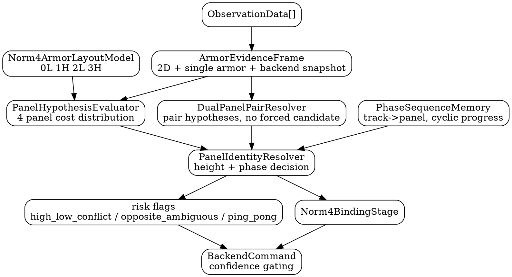

# Norm4 内部装甲板 ID 错配风险调研与替代模块设计

## 1. 问题定义

当前 Norm4 机器人共有 4 块装甲板，两高两低，定义：

```text
panel 0: low
panel 1: high
panel 2: low
panel 3: high
cyclic order: 0 -> 1 -> 2 -> 3 -> 0
```

需要重点排查两类错误：

1. **高低层错误**：0/2 低板与 1/3 高板分配错误，例如低板被重构为高板。
2. **同高度内部颠倒**：0 与 2，或 1 与 3 的高度分配正确但内部相位颠倒，例如匀速旋转真实序列应为 `0 1 2 3`，却被绑定成 `0 1 0 1`，导致结构状态表现为非完整周期的“来回扭动”。

结论：当前实现存在上述风险，尤其是第二类同高度内部颠倒风险。当前实现有“层级规则”，但缺少一个显式的“4板相位身份解析器”。

## 2. 当前实现风险点

### 2.1 panel 与 height 的绑定规则过于硬编码

当前 Norm4 多处使用：

```cpp
panel % 2 == 0 ? LOWER : UPPER
```

典型位置：

- `Norm4ArmorTracker::default_height_label_for_panel`
- `ObservationFrontend::default_height_label`
- `Norm4StructuredBackend::default_layer`
- `RobotBindingProfile::height_label_for`

这保证了：

```text
0/2 默认 low
1/3 默认 high
```

但它只表达了奇偶层级，并不区分：

```text
0 vs 2
1 vs 3
```

因此，当几何 yaw/xy 或中心估计被 ambiguous backend 带偏时，同高度对板可能互换。

### 2.2 单观测 candidate 默认只给一个 best panel

`ObservationFrontend::build_binding_candidate` 当前调用 `infer_panel_for_observation` 得到一个 `candidate_panel_id`，再用 cost margin 构造概率：

```text
candidate_panel_id = best panel
candidate_height_label = default_height_label(candidate_panel_id)
candidate_prob = f(best-second margin)
entropy_norm = soft distribution from margin
```

问题：

1. 没有保留 4 个 panel 的完整 cost/prob 分布；
2. 没有显式拆分“层级概率”和“相位概率”；
3. 当 0/2 或 1/3 cost 接近时，只看 best panel 会隐藏同高度二义性；
4. `candidate_height_label` 由 panel 默认得到，而不是独立高度判别结果。

这会导致后续 binder 只能消费一个已经压缩过的候选，难以发现“高度正确但相位不可信”。

### 2.3 双观测 assignment 可能把错误 pair 强化成强证据

`assign_dual_observations` 枚举相邻 panel pair，并用 yaw/xy/z cost 选最小组合。若 z 差超过阈值，会根据高低 z 强制 upper/lower。

随后 `apply_forced_assignment` 会把候选置信强行提高：

```text
candidate_prob >= 0.85
candidate_margin >= 0.50
entropy_norm <= 0.35
height_confidence >= 0.80
```

风险：

1. 双观测 assignment 一旦选错，错误会变成强证据进入 binder 和 mode FSM；
2. 它约束的是相邻 pair 和高低顺序，但没有对“整圈相位连续性”做全局校验；
3. 如果当前 center_yaw 或 center_pos 来自错误 ambiguous 反推，pair cost 可能系统性偏向错误相位。

### 2.4 Binder 能约束相邻跳变，但不能彻底防止 0101

四板 binder 依赖 `FourPanelJumpDecoder`：

```text
candidate 与 last_panel 相邻
z_jump 幅度足够
yaw_err 通过 gate
cost_margin 通过 gate
```

`SingleObsSequenceBinder` 在 jump detected 时可以按 cyclic order 推下一块，但当前 `FourPanelJumpDecoder` 通常直接设置：

```text
jump.to_id = input.candidate_id
```

也就是说，如果前端 candidate 已经在 0/2 或 1/3 之间错误选择，binder 会倾向接受 candidate，而不是强制按照 `current_bound_id + spin_direction` 的整圈相位序列修正。

因此，binder 能抵抗一部分“非相邻跳变”，但对下面这种错误仍有风险：

```text
真实: 0 -> 1 -> 2 -> 3
前端候选: 0 -> 1 -> 0 -> 1
```

每一步 `0<->1` 都是相邻，z jump 也可能像合法高低跳变，因此仅靠邻接和 z jump gate 不足以发现“没有走完整周期”。

### 2.5 ambiguous backend 的中心反推可能自强化错误相位

当前 `AMBIGUOUS` 模式中，单板后端跟踪装甲板，再用 `panel_id / radius / layer / dza` 反推中心。

如果 panel_id 错：

```text
center_xy = armor_xy - radius * [cos(armor_yaw), sin(armor_yaw)]
center_yaw = armor_yaw - panel_angle(panel_id)
```

错误 panel_id 会直接改变 center 和 center_yaw。下一帧 association 又使用这个 center/yaw 作为先验，可能形成：

```text
错误 panel -> 错误 center_yaw -> 错误 candidate -> 更稳定的错误 panel
```

这会放大 0/2 或 1/3 内部颠倒风险。

### 2.6 PanelMismatchDetector 主要修正高低层错配，不足以处理 0/2、1/3 相位颠倒

`PanelMismatchDetector` 通过 z residual 判断当前 layer 与 flipped layer 哪个更合理。它建议的新 panel 是：

```text
new_panel_id = panel_id ^ 1
```

这主要处理奇偶翻转，即：

```text
0 <-> 1
2 <-> 3
```

但 0/2、1/3 是同高度相位颠倒，z residual 基本不能区分，因此该 detector 不能覆盖“高度正确但内部颠倒”。

## 3. 风险结论

| 风险 | 当前是否可能 | 原因 |
|---|---:|---|
| 0/2 low 被分成 1/3 high | 可能 | 单观测 layer 默认来自 panel；candidate 错则 layer 跟错；dza 未收敛时缺独立高度判别 |
| 1/3 high 被分成 0/2 low | 可能 | 同上 |
| 0 与 2 高度正确但内部颠倒 | 可能且较隐蔽 | z 无法区分，依赖 yaw/xy/center_yaw；当前无相位周期状态 |
| 1 与 3 高度正确但内部颠倒 | 可能且较隐蔽 | 同上 |
| 匀速旋转被绑定成 0101 / 1212 | 可能 | 邻接 + 高低跳变仍可通过；缺少整圈 phase coverage / spin sequence 检查 |
| 错误相位污染结构化 UKF | 可能 | `panel_angle/r_type/layer` 直接进入 UKF update |

## 4. 替代模块目标

新版 Norm4Tracker 应新增一个明确的模块：

```text
Norm4PanelIdentityResolver
```

它替代当前 `ObservationFrontend::build_binding_candidate + assign_dual_observations + apply_forced_assignment` 的核心身份判别职责。

目标：

1. 独立判断 height parity：low/high。
2. 独立判断 phase identity：0 vs 2、1 vs 3。
3. 对单观测、双观测、2D track、single armor proxy、结构化 backend snapshot 统一打分。
4. 维护整圈相位序列，防止 `0101` 这类假周期。
5. 输出完整 panel hypothesis distribution，而不是只输出 best candidate。
6. 只供新版 Norm4Tracker 使用，不改 Adaptive/Outpost 稳定链路。

## 5. 新模块设计

### 5.1 Norm4ArmorLayoutModel

职责：集中定义 Norm4 的物理布局语义。

```cpp
struct Norm4PanelSpec {
  int panel_id = -1;
  binder::HeightLabel height = binder::HeightLabel::UNKNOWN;
  double yaw_offset = 0.0;
  std::string radius_type;  // "r1" or "r2"
};

class Norm4ArmorLayoutModel {
 public:
  static constexpr int kPanelCount = 4;

  const Norm4PanelSpec& panel(int panel_id) const;
  int next_panel(int panel_id, int spin_direction) const;
  int prev_panel(int panel_id, int spin_direction) const;
  bool adjacent(int a, int b) const;
  bool same_height(int a, int b) const;
  binder::HeightLabel height_of(int panel_id) const;
  double yaw_offset_of(int panel_id) const;
};
```

默认布局：

```text
0: low,  yaw offset 0
1: high, yaw offset +pi/2
2: low,  yaw offset pi
3: high, yaw offset -pi/2
```

所有 `panel % 2`、`panel * pi/2`、`r1/r2` 逻辑应逐步收敛到这个 model，而不是散落在多个类中。

### 5.2 Norm4PanelHypothesisEvaluator

职责：对每个 observation 计算 4 个 panel 的完整 cost。

```cpp
struct Norm4PanelCost {
  int panel_id = -1;

  double total_cost = 0.0;
  double yaw_cost = 0.0;
  double xy_cost = 0.0;
  double height_cost = 0.0;
  double track_continuity_cost = 0.0;
  double phase_transition_cost = 0.0;

  double probability = 0.0;
  binder::HeightLabel height_label = binder::HeightLabel::UNKNOWN;
};

struct Norm4ObservationPanelHypotheses {
  int observation_index = -1;
  std::array<Norm4PanelCost, 4> panels;
  int best_panel = -1;
  double entropy_norm = 1.0;
  double best_margin = 0.0;
};
```

cost 来源：

```text
yaw_cost: abs(normalize(obs.yaw - (center_yaw + yaw_offset(panel))))
xy_cost:  abs(obs_xy - predicted_armor_xy(panel))
height_cost: obs.z 与 low/high 预测、HeightIdentifier、single armor z stats
track_continuity_cost: track2d_id 上次绑定 panel 的连续性
phase_transition_cost: 是否符合 spin_direction 下的 next/prev/same 转移
```

关键点：

```text
height_cost 只判断 low/high
phase_transition_cost 判断 0/2 或 1/3 内部身份
```

这样高低错配和同高度相位错配被拆成两个可调试问题。

### 5.3 Norm4DualPanelPairResolver

职责：双观测时联合解析两个观测的 panel pair，不再在前端直接强改 candidate。

```cpp
struct Norm4PairHypothesis {
  int obs_i = -1;
  int obs_j = -1;
  int panel_i = -1;
  int panel_j = -1;

  double total_cost = 0.0;
  double z_order_cost = 0.0;
  double adjacency_cost = 0.0;
  double geometry_cost = 0.0;
  double track_pair_cost = 0.0;
  double phase_sequence_cost = 0.0;

  double confidence = 0.0;
};

class Norm4DualPanelPairResolver {
 public:
  std::vector<Norm4PairHypothesis> evaluate_pairs(
      const ArmorEvidenceFrame& evidence,
      const Norm4PanelIdentityMemory& memory,
      const Norm4BackendSnapshot& snapshot) const;
};
```

约束：

1. pair 必须相邻，除非处于 reacquire 且证据极强。
2. z order 只用于判断 upper/lower，不直接决定 0/2 或 1/3。
3. 若两个 observation 都有 stable `track2d_id`，优先保持 track 到 panel 的历史映射。
4. 输出 pair hypotheses，交给 resolver/binder 融合，不直接把 `candidate_prob` 提到 0.85。

### 5.4 Norm4PhaseSequenceMemory

职责：维护整圈相位记忆，专门检测 0101 / 1212 这类假周期。

```cpp
struct Norm4PhaseSequenceMemory {
  int bound_panel_id = -1;
  int spin_direction = 0;  // -1, 0, +1

  std::deque<int> selected_panel_history;
  std::deque<int> committed_panel_history;
  std::unordered_map<Track2DId, int> track_to_panel;
  std::unordered_map<Track2DId, binder::HeightLabel> track_to_height;

  int full_cycle_progress = 0;
  double phase_confidence = 0.0;
};
```

新增检测：

```text
opposite_same_height_jump:
  0 <-> 2 或 1 <-> 3，单帧不可直接接受，除非 reacquire + yaw/xy 极强。

ping_pong_pattern:
  最近窗口出现 ABAB，且 A/B 相邻但没有进入 A->B->C->D，判为非完整周期风险。

missing_phase_progress:
  spin_direction 明确时，连续跳变应推动 phase progress 单调前进。
```

新增动力学一致性约束（来自 `SingleArmorProxyManager`）：

```text
kinematic_inconsistency:
  若同一 track2d_id 在 panel A/B 间切换后，single armor 的速度/加速度/yaw_rate
  与切换前窗口显著不连续，则提高 phase_transition_cost。

abab_with_kinematic_conflict:
  当窗口出现 A->B->A->B，且每次回跳都伴随高 jerk 或速度方向突变，
  将 ping_pong_risk 提升到 hard risk，禁止立即 commit 回跳 panel。
```

对 `0101` 的约束：

```text
如果 spin_direction 稳定且连续出现 0->1->0，
第二个 0 应被视为 phase regression，
除非有强证据表明机器人确实反向转动或发生 reacquire。
```

建议评分融合：

```text
phase_score =
  w_seq * sequence_consistency
  + w_geo * yaw_xy_consistency
  + w_dyn * kinematic_consistency

其中 kinematic_consistency 来自 SingleArmorTrackEvidence 的:
- armor_vel 连续性
- armor_acc 平滑性（可由速度差分估计）
- armor_yaw_rate 连续性
```

### 5.5 Norm4PanelIdentityResolver

总入口模块：

```cpp
struct Norm4PanelIdentityDecision {
  int selected_observation = -1;
  int selected_panel_id = -1;
  binder::HeightLabel selected_height = binder::HeightLabel::UNKNOWN;

  std::array<double, 4> panel_prob{};
  double panel_confidence = 0.0;
  double height_confidence = 0.0;
  double phase_confidence = 0.0;
  double entropy_norm = 1.0;

  bool high_low_conflict = false;
  bool opposite_pair_ambiguous = false;
  bool ping_pong_risk = false;
  bool allow_backend_update = true;

  std::string reason;
};

class Norm4PanelIdentityResolver {
 public:
  void reset(int init_panel_id, binder::HeightLabel init_height);

  Norm4PanelIdentityDecision resolve(
      const ArmorEvidenceFrame& evidence,
      const Norm4BackendSnapshot& backend,
      const Norm4RuntimeFlags& flags);

  const Norm4PhaseSequenceMemory& memory() const;
};
```

输出进入后续：

```text
Norm4BindingStage
ModeDecider
BackendPlanner
BackendExecutor
```

如果 `ping_pong_risk` 或 `opposite_pair_ambiguous` 为 true：

```text
降低 position_confidence
禁止 reset structured backend
优先保持当前 bound panel
必要时只更新 single armor proxy，不更新 DualRadiusSpinUKF
```

## 6. 新版 Norm4 调用链

```text
ObservationData[]
→ Tracking2D
→ SingleArmorProxyManager
→ ArmorEvidenceFrame
→ Norm4PanelHypothesisEvaluator
→ Norm4DualPanelPairResolver
→ Norm4PanelIdentityResolver
→ Norm4BindingStage
→ ModeDecider
→ BackendPlanner
→ BackendExecutor
```

关键变化：

1. `ObservationFrontend` 不再直接决定最终 candidate。
2. 双观测不再通过 `apply_forced_assignment` 强化单个 candidate。
3. height parity 和 phase identity 分别评分。
4. `0/2`、`1/3` 的相位颠倒有专门风险标志。
5. `0101` 这类 ping-pong pattern 会进入 mode/backend command 的降权逻辑。

## 7. 设计如何覆盖两类风险

### 7.1 防止高低板错配

新增 `height_cost`：

```text
来自 dza/center_z 的 low/high 预测
来自 HeightIdentifier 的单帧/历史判断
来自 dual observation z order
来自 SingleArmorTrackEvidence 的 z stats
```

当 panel candidate 的默认 height 与独立 height evidence 冲突：

```text
high_low_conflict = true
降低该 panel hypothesis
必要时禁止结构化 UKF 强更新
```

### 7.2 防止 0/2 或 1/3 内部颠倒

新增 `phase_transition_cost`：

```text
同一个 track2d_id 不能无强证据从 0 跳到 2，或从 1 跳到 3。
spin_direction 稳定时，bound panel 应按 cyclic order 单调推进。
```

新增 `opposite_pair_ambiguous`：

```text
如果 0 和 2 cost 接近，或 1 和 3 cost 接近，
输出低 phase_confidence，而不是强行选 best。
```

### 7.3 防止 0101 假周期

新增 `ping_pong_risk`：

```text
窗口内出现 A B A B，且 spin_direction 未反转，
则判定可能错误地把整圈相位压缩成相邻往返。
```

处理：

```text
hold 当前 bound panel 或按 expected next panel 修正；
降低结构化 update confidence；
必要时只发布 single armor proxy；
等待 dual observation 或更强 yaw/xy 证据恢复。
```

增加动力学门控（与上面处理并行）：

```text
若 A<->B 回跳时 single armor 动力学不连续：
  - 切换进入 pending，不直接 bound switch
  - 要求连续 N 帧 kinematic_consistency 达标后才 commit
  - 在此期间 structured backend 仅允许低权重 update 或 hold
```

## 8. 与现有 binder 的关系

现有 `BinderPipeline` 可以继续保留，但新版 Norm4 不应再把 raw `candidate_panel_id` 直接送入 binder。

建议输入 binder 的 candidate 改为：

```text
resolver.selected_panel_id
resolver.panel_confidence
resolver.phase_confidence
resolver.entropy_norm
resolver.reason flags
```

如果 resolver 标记风险：

```text
candidate_prob 降权
event_type 设置为 AMBIGUOUS 或 SWITCH_CANDIDATE_LOW_CONF
binding_conflict_for_update = true
```

这样 binder 仍负责 bound/pending/switch FSM，但身份判别更干净。

## 9. 最小落地版本

第一版不必一次实现全部概率图。建议最小落地：

1. 新增 `Norm4ArmorLayoutModel`。
2. 新增 `Norm4PanelHypothesisEvaluator`，输出 4 panel cost，而不是 best only。
3. 新增 `Norm4PhaseSequenceMemory`，检测：
   - `0<->2`
   - `1<->3`
   - `A B A B` ping-pong
4. 给 `Norm4PhaseSequenceMemory` 接入 `SingleArmorTrackEvidence` 动力学摘要
   （速度、加速度差分、yaw_rate 连续性），用于 `kinematic_inconsistency` 判定。
5. 替换 `apply_forced_assignment`：双观测只输出 pair evidence，不直接强改 candidate。
6. 在 `BackendPlanner` 中（并由 `BackendExecutor` 执行）：
   - phase_confidence 低时降低 `position_confidence`；
   - ping_pong_risk 时禁止 reset structured backend；
   - 优先输出 single armor proxy。

这样就能优先覆盖你关心的两个核心风险。

## 10. 建议文件

```text
include/max_entropy_tracker/trackers/norm4_v2/norm4_armor_layout_model.hpp
include/max_entropy_tracker/trackers/norm4_v2/norm4_panel_hypothesis_evaluator.hpp
include/max_entropy_tracker/trackers/norm4_v2/norm4_dual_panel_pair_resolver.hpp
include/max_entropy_tracker/trackers/norm4_v2/norm4_phase_sequence_memory.hpp
include/max_entropy_tracker/trackers/norm4_v2/norm4_panel_identity_resolver.hpp

src/max_entropy_tracker/trackers/norm4_v2/norm4_armor_layout_model.cpp
src/max_entropy_tracker/trackers/norm4_v2/norm4_panel_hypothesis_evaluator.cpp
src/max_entropy_tracker/trackers/norm4_v2/norm4_dual_panel_pair_resolver.cpp
src/max_entropy_tracker/trackers/norm4_v2/norm4_phase_sequence_memory.cpp
src/max_entropy_tracker/trackers/norm4_v2/norm4_panel_identity_resolver.cpp
```

这些模块只供新版 `Norm4ArmorTracker` 使用，不影响 Adaptive/Outpost。

## 11. Graphviz


