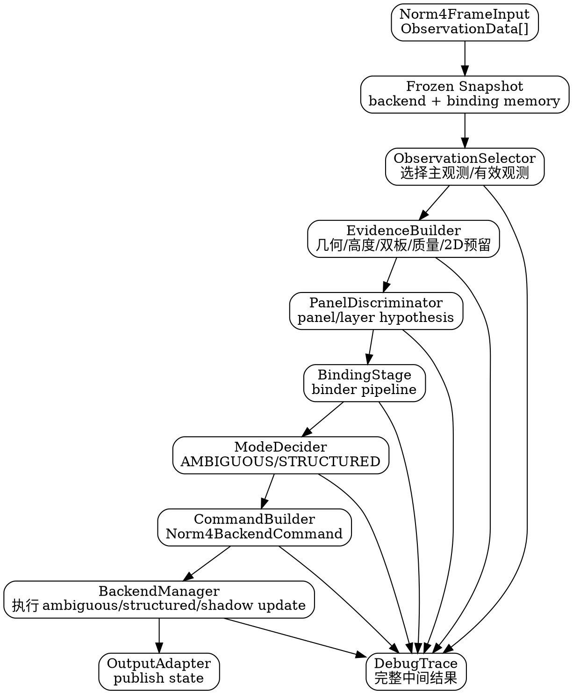

# Norm4ArmorTracker 串行 Pipeline 重设计建议

> 术语收敛说明：本文中历史术语 `Norm4CommandBuilder / Norm4BackendManager / Norm4BackendCommand`，
> 在统一语义上分别对应 `BackendPlanner / BackendExecutor / BackendIntent(或 BackendExecutionPlan)`。
> 以 `terminology_and_tracker_colocation_convergence.md` 为最终约束。

## 1. 结论

综合当前实现、DAG 架构文档和 2D-binder 方案，建议不要立即把 `Norm4ArmorTracker` 改成完整通用 DAG Runtime。当前更合适的路线是：

```text
保留 BaseTracker 对外接口
内部改成固定顺序的 Serial Pipeline
引入清晰的数据契约：Evidence -> Binding -> Decision -> BackendCommand -> BackendUpdate -> Output
```

这样可以解决当前 Norm4 的主要问题：

1. `Norm4ArmorTracker::update()` 中同时处理观测选择、双板 assignment、binder、mode、backend update、shadow update、debug，语义过密；
2. `candidate_panel_id / selected_panel / bound_panel / pending_panel / current_panel` 混在同一层，容易误用；
3. `AMBIGUOUS` 与 `STRUCTURED` 的后端更新策略不够显式，shadow update 的副作用难追踪；
4. `height_label / layer / position_confidence` 的来源不清晰，调参时难定位问题；
5. 后续接入 2D tracker 时，当前 `ObservationFrontend -> BinderBridge` 的输入口不够自然。

推荐目标是形成：

```text
Norm4ArmorTracker                 // BaseTracker 外壳，生命周期与 ROS 对接
  └── Norm4SerialPipeline          // 每帧固定调用链
        ├── Norm4FrameBuilder      // 统一输入帧
        ├── Norm4EvidenceExtractor // 3D/dual/height/quality evidence
        ├── Norm4PanelDiscriminator// panel/layer 候选概率
        ├── Norm4BindingStage      // binder pipeline 适配
        ├── Norm4ModeDecider       // AMBIGUOUS/STRUCTURED 决策
        ├── Norm4CommandBuilder    // 生成后端更新命令
        ├── Norm4BackendManager    // 执行后端更新与 snapshot 管理
        ├── Norm4OutputAdapter     // 发布状态构造
        └── Norm4DebugTrace        // 调用链可解释记录
```

## 2. 从现有设计文档中可取的部分

### 2.1 Evidence DAG 文档

可取点：

1. 区分 `tracker_id / panel_id / armor_id / robot_track_id`，避免把临时跟踪 ID 和结构 ID 混用。
2. Evidence 只生产证据，不直接修改 tracker 状态。
3. Discriminator 只输出假设，不直接更新 UKF。
4. 多源证据需要有统一的置信度和 debug 输出。

当前 Norm4 可以先落地其中的 `panel_id` 语义拆分：

```text
observed_panel_id   // 前端几何关联候选
candidate_panel_id  // 判别器输出候选
selected_panel_id   // 本帧用于后端更新的 panel
bound_panel_id      // binder 稳定绑定的 panel
backend_panel_id    // 后端 snapshot 当前认为的 panel
```

### 2.2 DAG Runtime 文档

可取点：

1. TrackerManager 作为图外状态资产管理器；
2. 每帧基于 frozen snapshot 计算 evidence/decision；
3. 所有状态修改收敛到 command applier；
4. DebugBus 记录 before/decision/after。

暂缓点：

1. `GraphRuntime / NodeMeta / PortBundle / DAG compile` 暂不实现；
2. 不做 YAML 动态拓扑；
3. 不把每个模块包装成通用节点。

原因是 Norm4 当前需要的是调用链干净，而不是节点调度能力。

### 2.3 Serial Pipeline 文档

这是最适合当前阶段的方案。建议直接吸收：

```text
FrameInput
→ Evidence Stage
→ Discriminator / Binding Stage
→ Backend Mode Decision Stage
→ Backend Update Stage
→ Output Stage
→ Debug Trace
```

区别是当前上游还没有完整 2D detection 输入，因此第一阶段先使用现有 `ObservationData`，预留 2D evidence 字段。

### 2.4 2D-binder 文档

可取点：

1. 2D tracker 放在 binder/tracker 域内，而不是 detector 发布全局 `track_id`；
2. `track_id` 只表示图像域短时连续性，不等于 `panel_id`；
3. 2D evidence 先作为 soft evidence 接入，不替代 3D 关联；
4. `z_mean/z_var` 可为上下层和 jump 判别提供局部稳定先验。

建议 Norm4 先预留：

```cpp
struct Norm4TwoDEvidence {
  bool valid = false;
  int track_id = -1;
  double association_quality = 0.0;
  double z_mean = 0.0;
  double z_var = 0.0;
  int z_count = 0;
};
```

第一阶段不实现 2D tracker，只让数据结构和 debug 链路能容纳它。

## 3. 当前 Norm4 应避免继续扩展的问题

### 3.1 `ObservationFrontend` 职责过宽

当前它同时做：

1. primary observation 选择；
2. panel 几何关联；
3. binding candidate 构造；
4. dual observation assignment；
5. forced assignment 后直接修改候选概率。

建议拆成：

```text
Norm4ObservationSelector
  只决定当前帧有哪些可用观测、主观测是谁

Norm4GeometryAssociator
  只计算每个 observation 对 0..3 panel 的几何代价/概率

Norm4DualEvidenceBuilder
  只计算双板关系证据，不直接强行改 candidate

Norm4PanelDiscriminator
  汇总几何、双板、高度、历史证据，输出 panel/layer 假设
```

### 3.2 `BackendUpdateHint` 语义偏弱

当前 `BackendUpdateHint` 混合了“选择结果”和“滤波权重”：

```text
panel_id
height_label
height_confidence
position_confidence
r1/r2/dza hint
```

建议改名并升级为 `Norm4BackendCommand`，让其明确表达“本帧要如何更新后端”：

```cpp
struct Norm4BackendCommand {
  mode::TrackMode target_mode = mode::TrackMode::AMBIGUOUS;

  bool reset_backend = false;
  bool update_ambiguous = false;
  bool update_structured_single = false;
  bool update_structured_dual = false;
  bool update_shadow_backend = false;

  int selected_obs_index = -1;
  int selected_panel_id = -1;
  binder::HeightLabel selected_height_label = binder::HeightLabel::UNKNOWN;

  double height_confidence = 0.0;
  double position_confidence = 0.0;
  double binding_confidence = 0.0;
  double association_confidence = 0.0;

  bool binding_conflict = false;
  std::string reason;
};
```

后端只执行 command，不再参与判别。

### 3.3 `ctx_` 同时承担运行状态与证据缓存

`Norm4RuntimeContext` 当前既保存后端状态，也保存 binder/mode 需要的历史字段。建议拆成：

```text
Norm4BackendSnapshot   // 后端状态：center/radius/dza/yaw/vel
Norm4BindingMemory     // bound panel、last obs z、spin direction、binding confidence
Norm4FrameEvidence     // 本帧证据，只活一帧
Norm4PublishState      // 输出适配缓存
```

这样可以避免 evidence 读取到半更新状态。

## 4. 推荐的新数据模型

### 4.1 Frame 输入

```cpp
struct Norm4FrameInput {
  std::vector<ObservationData> observations;
  std::optional<double> timestamp;
  uint64_t frame_seq = 0;
};
```

### 4.2 Frozen snapshot

每帧 update 开始时冻结一次后端和绑定状态：

```cpp
struct Norm4FrameSnapshot {
  mode::TrackMode mode = mode::TrackMode::AMBIGUOUS;

  norm4_v2::BackendStateSnapshot active_backend;
  norm4_v2::BackendStateSnapshot ambiguous_backend;
  norm4_v2::BackendStateSnapshot structured_backend;

  int selected_panel_id = -1;
  int bound_panel_id = -1;
  binder::HeightLabel bound_height_label = binder::HeightLabel::UNKNOWN;
  double binding_confidence = 0.0;

  std::optional<double> last_obs_z;
  std::optional<double> last_timestamp;
  int lost_frames = 0;
};
```

### 4.3 观测级 evidence

```cpp
struct Norm4ObservationEvidence {
  int obs_index = -1;
  ObservationData obs;

  int geometric_panel_id = -1;
  std::array<double, 4> panel_cost{};
  std::array<double, 4> panel_prob{};
  double entropy_norm = 1.0;
  double max_prob = 0.0;

  double selected_yaw_err = 0.0;
  double selected_xy_residual = 0.0;
  double cost_margin = 0.0;

  binder::HeightLabel height_label_hint = binder::HeightLabel::UNKNOWN;
  double height_confidence = 0.0;

  Norm4TwoDEvidence two_d;
};
```

当前 `PanelAssociator::AssociationDiagnostics` 只有 best/second，不能直接输出四 panel 概率。短期可以仍用 best/second 构造概率；中期可扩展 `PanelAssociator` 输出所有 panel cost。

### 4.4 双观测 evidence

```cpp
struct Norm4DualEvidence {
  bool valid = false;
  int obs_index_1 = -1;
  int obs_index_2 = -1;

  int panel_id_1 = -1;
  int panel_id_2 = -1;
  binder::HeightLabel label_1 = binder::HeightLabel::UNKNOWN;
  binder::HeightLabel label_2 = binder::HeightLabel::UNKNOWN;

  double assignment_cost = 0.0;
  double assignment_confidence = 0.0;
  double height_confidence = 0.0;
  bool strong_z_order = false;
};
```

注意：dual evidence 不直接修改单观测 candidate，而是作为 `PanelDiscriminator` 的输入。

### 4.5 Panel 判别输出

```cpp
struct Norm4PanelHypothesis {
  int selected_obs_index = -1;
  int candidate_panel_id = -1;
  binder::HeightLabel height_label = binder::HeightLabel::UNKNOWN;

  double panel_confidence = 0.0;
  double height_confidence = 0.0;
  double entropy_norm = 1.0;
  double margin = 0.0;

  bool from_dual_assignment = false;
  bool ambiguous = false;
  std::string reason;
};
```

### 4.6 Binding 输出

```cpp
struct Norm4BindingDecision {
  int selected_panel_id = -1;
  int bound_panel_id = -1;
  int pending_panel_id = -1;

  binder::HeightLabel selected_height_label = binder::HeightLabel::UNKNOWN;
  double binding_confidence = 0.0;

  bool switch_pending = false;
  bool switch_confirmed = false;
  bool conflict_for_update = false;
  int reason_code = 0;
};
```

### 4.7 Mode 输出

```cpp
struct Norm4ModeDecision {
  mode::TrackMode mode = mode::TrackMode::AMBIGUOUS;
  bool switched = false;
  double confidence = 0.0;
  std::string reason;
};
```

### 4.8 Backend command

```cpp
struct Norm4BackendCommand {
  mode::TrackMode target_mode = mode::TrackMode::AMBIGUOUS;
  bool reset_active_backend = false;

  bool update_active = true;
  bool update_shadow = true;
  bool structured_dual_update = false;

  int selected_obs_index = -1;
  int selected_panel_id = -1;
  binder::HeightLabel selected_height_label = binder::HeightLabel::UNKNOWN;

  double height_confidence = 0.0;
  double position_confidence = 0.0;

  std::optional<Norm4DualEvidence> dual;
  std::string reason;
};
```

## 5. 推荐头文件组织

保持当前 `norm4_v2` 目录，不新建大包。建议新增或重命名为：

```text
include/max_entropy_tracker/trackers/norm4_v2/
  norm4_types.hpp                 // 上述 frame/evidence/decision/command 类型
  norm4_pipeline.hpp              // SerialPipeline 编排
  norm4_observation_selector.hpp  // 主观测选择
  norm4_geometry_associator.hpp   // panel 几何代价
  norm4_evidence_builder.hpp      // dual/height/quality evidence
  norm4_panel_discriminator.hpp   // panel/layer 假设融合
  norm4_binding_stage.hpp         // BinderBridge 的更清晰封装
  norm4_mode_decider.hpp          // EvidenceFuser + ModeFSM 封装
  norm4_backend_manager.hpp       // ambiguous/structured 后端统一执行命令
  norm4_debug_trace.hpp           // 每帧 debug trace
```

现有文件迁移关系：

| 当前文件 | 建议去向 |
|---|---|
| `norm4_observation_frontend.hpp` | 拆为 selector / geometry_associator / evidence_builder / panel_discriminator |
| `norm4_binder_bridge.hpp` | 保留核心适配，外层改名或包装为 `norm4_binding_stage.hpp` |
| `norm4_runtime_context.hpp` | 拆为 snapshot/memory/publish state，或先在 `norm4_types.hpp` 新增类型后逐步替换 |
| `norm4_structured_backend.hpp` | 保留，接口从 `BackendUpdateHint` 迁移到 command 中的 update spec |
| `norm4_ambiguous_backend.hpp` | 保留，接口同上 |
| `norm4_output_adapter.hpp` | 保留，输入改为 backend snapshot + publish state |
| `norm_4armor_tracker.hpp` | 只保留 BaseTracker API、pipeline 成员、debug snapshot 转发 |

## 6. 新 `Norm4ArmorTracker` 的语义

`Norm4ArmorTracker` 应变成薄外壳：

```cpp
class Norm4ArmorTracker : public BaseTracker {
 public:
  void initialize(const std::vector<ObservationData>& obs,
                  double r1, double r2, double dza) override;
  void predict(std::optional<double> target_time) override;
  bool update(const std::vector<ObservationData>& obs) override;

  Eigen::Vector3d get_center_position() const override;
  double get_yaw() const override;
  std::pair<double, double> get_radii() const override;
  SpinFilterInterface& spin_filter() override;
  const SpinFilterInterface& spin_filter() const override;

  const DebugSnapshot& debug_snapshot() const;

 private:
  UnifiedConfig config_;
  norm4_v2::Norm4SerialPipeline pipeline_;
};
```

它不再直接持有：

```text
ObservationFrontend
BinderBridge
EvidenceFuser
ModeFSM
AmbiguousBackend
StructuredBackend
OutputAdapter
HeightIdentifier
PanelMismatchDetector
ManeuverDetector
ctx_
```

这些应由 `Norm4SerialPipeline` 或其子模块管理。外壳只处理 `BaseTracker` 状态计数与接口转发；如果为了减少改动，也可以让 pipeline 返回 `FrameUpdateResult`，外壳据此调用 `handle_observation_received/loss` 和 `increment_frame()`。

## 7. 推荐调用链

```cpp
Norm4FrameUpdateResult Norm4SerialPipeline::update(
    const Norm4FrameInput& input,
    const Norm4TrackerState& base_state) {
  debug.begin(input);

  auto snapshot = backend_manager_.makeSnapshot(binding_stage_.memory());

  auto selected =
      observation_selector_.select(input.observations, snapshot);

  auto obs_evidence =
      evidence_builder_.buildObservationEvidence(input, snapshot);

  auto dual_evidence =
      evidence_builder_.buildDualEvidence(input, snapshot, obs_evidence);

  auto panel_hypothesis =
      panel_discriminator_.evaluate(obs_evidence, dual_evidence, snapshot);

  auto binding_decision =
      binding_stage_.step(panel_hypothesis, obs_evidence, dual_evidence, snapshot);

  auto mode_decision =
      mode_decider_.decide(panel_hypothesis, binding_decision, dual_evidence, snapshot);

  auto command =
      command_builder_.build(panel_hypothesis, binding_decision, mode_decision,
                             dual_evidence, snapshot);

  auto backend_result =
      backend_manager_.apply(command, input.observations);

  auto output =
      output_adapter_.update(backend_result.snapshot, command);

  debug.end(...);
  return result;
}
```

关键约束：

1. `EvidenceBuilder / PanelDiscriminator / BindingStage / ModeDecider` 不直接更新后端；
2. `BackendManager` 不重新判别 panel，只执行 command；
3. `OutputAdapter` 不修改 binding 或 backend；
4. 每帧 debug trace 包含所有中间结果。

## 8. 低难度迁移步骤

### Phase 0：只加类型和 debug，不改行为

新增 `norm4_types.hpp` 和 `norm4_debug_trace.hpp`，把当前 `update()` 中的中间变量记录为结构化 trace：

```text
selected_obs_index
candidate_panel_id
dual_assignment
binder_out
mode_decision
backend_hint
active_backend
```

收益：先把“为什么这一帧这样更新”看清楚。

### Phase 1：抽出 `Norm4SerialPipeline`

把当前 `Norm4ArmorTracker` 中的成员平移进 pipeline，行为不变。`Norm4ArmorTracker` 只转发：

```text
initialize -> pipeline.initialize
predict    -> pipeline.predict
update     -> pipeline.update
get_*      -> pipeline.snapshot
```

收益：先让外壳变薄，后续拆模块不影响 BaseTracker 接口。

### Phase 2：把 `BackendUpdateHint` 升级为 `Norm4BackendCommand`

保持字段来源不变，但显式记录：

```text
active mode
是否 shadow update
是否 dual update
是否 reset
position_confidence 来源
```

收益：直接降低 ambiguous/structured/shadow 的副作用不透明问题。

### Phase 3：拆 `ObservationFrontend`

按低风险顺序拆：

1. `select_primary_observation` -> `Norm4ObservationSelector`
2. `assign_dual_observations` -> `Norm4DualEvidenceBuilder`
3. `build_binding_candidate` -> `Norm4PanelDiscriminator`

短期内部可继续复用原函数，先改接口语义。

### Phase 4：引入单观测高度判别

把 Adaptive 中 `HeightIdentifier::identify_single` 的思想接入 `Norm4PanelDiscriminator`：

```text
单观测不再只用 panel 奇偶默认 layer
而是基于 obs.z / center_z / dza / dza_converged 输出 height_label + confidence
```

这是提升 Norm4 实战效果的高性价比改动。

### Phase 5：预留 2D evidence 接口

先不实现 2D tracker，只在 evidence 类型和 binder 输入中预留可选字段：

```text
track_id
assoc_quality
z_mean/z_var/z_count
```

后续 2D-binder 可以无侵入接入。

## 9. 不建议立即做的事

1. 不建议马上实现通用 DAG Runtime。当前模块数量不足以抵消基础设施成本。
2. 不建议让 2D tracker 直接决定 panel_id。它只能提供连续性和 z 统计软证据。
3. 不建议让 binder 直接调用 backend update。binding 输出应通过 command 进入 BackendManager。
4. 不建议在 `ObservationFrontend` 里继续硬改 candidate probability。双板证据应作为 evidence 进入 discriminator，而不是在前端直接“变强证据”。
5. 不建议把 `armor_id` 与 `panel_id` 混为一谈。Norm4 当前主要处理结构 panel；机器人业务 armor number 应在更上层或独立 discriminator 中处理。

## 10. 最小可行版本接口草案

如果只做最小改造，新增三个文件即可：

```text
norm4_types.hpp
norm4_serial_pipeline.hpp
norm4_serial_pipeline.cpp
```

`Norm4SerialPipeline` 可以先拥有当前所有子模块：

```cpp
class Norm4SerialPipeline {
 public:
  explicit Norm4SerialPipeline(const UnifiedConfig& config, double dt);

  void initialize(const std::vector<ObservationData>& obs,
                  double r1, double r2, double dza);
  void predict(std::optional<double> target_time);
  Norm4FrameUpdateResult update(const std::vector<ObservationData>& obs,
                                BaseTrackerFrameState base_state);

  const Norm4PipelineSnapshot& snapshot() const;
  SpinFilterInterface& structured_filter();
  const SpinFilterInterface& structured_filter() const;

 private:
  Norm4FrameTrace trace_;
  Norm4RuntimeContext ctx_;  // Phase 1 可暂时保留

  ObservationFrontend obs_frontend_;
  Norm4BinderBridge binder_bridge_;
  mode::EvidenceFuser evidence_fuser_;
  mode::ModeFSM mode_fsm_;
  Norm4AmbiguousBackend ambiguous_backend_;
  Norm4StructuredBackend structured_backend_;
  Norm4OutputAdapter output_adapter_;
  HeightIdentifier height_identifier_;
  PanelMismatchDetector mismatch_detector_;
  ManeuverDetector maneuver_detector_;
};
```

这一步几乎只是“搬家”，实现难度低。后续再逐个替换内部类型。

## 11. Graphviz：推荐串行架构



## 12. 最重要的语义边界

重设计后要坚持下面几条：

```text
ObservationSelector 只选观测，不判 panel。
GeometryAssociator 只算代价，不绑定 ID。
PanelDiscriminator 只输出 panel/layer 假设，不更新后端。
BindingStage 只维护 bound/pending/switch，不直接调 UKF。
ModeDecider 只决定模式，不构造 KF 观测。
CommandBuilder 是唯一把 evidence/decision 翻译成后端更新命令的地方。
BackendManager 是唯一执行滤波器 update/reset 的地方。
OutputAdapter 只读 snapshot。
```

这套边界能让 Norm4 的语义接近 DAG 架构，但实现仍然是普通 C++ 串行调用链，工程风险可控。
